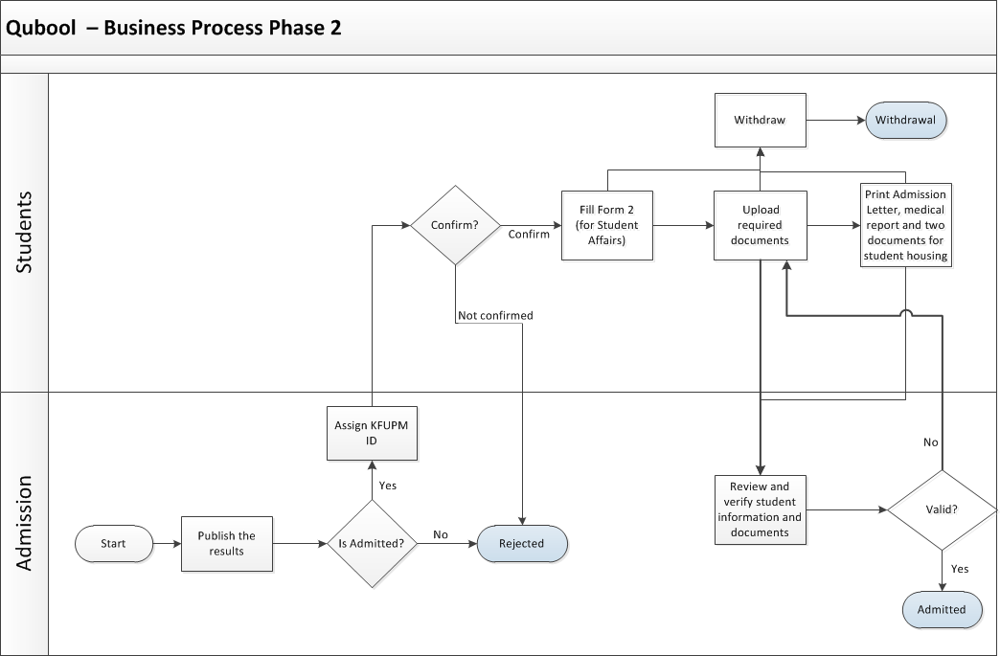
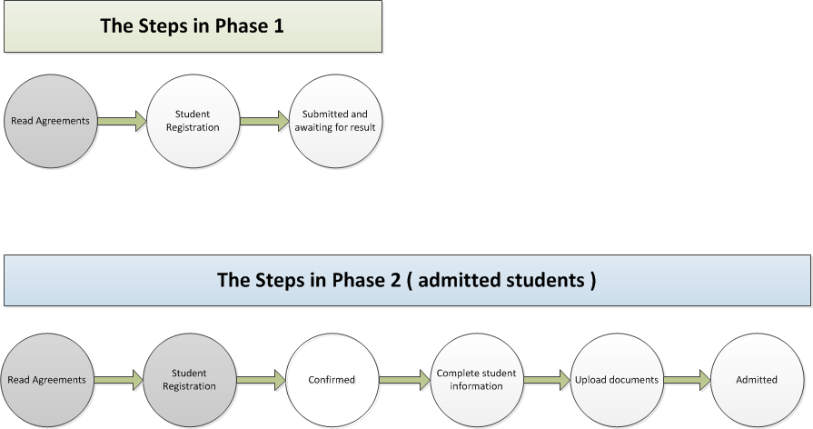

= Software Requirements Specification for Qabool
Abdullah Joud <joud@kfupm.edu.sa>; Bassam Almaaesh <almaaesh@kfupm.edu.sa>;
VERSION, DATE, VERSION DESCIPTION
:docinfo1:

include::includes/proprietary-information.adoc[]

== Introduction

=== Purpose and Intended Audience

The purpose of this document is to give a detailed description
of the requirements for _Qabool_.
It will contain all the details of the requested functionality as well as the wire-frames
that will be used in designing the system. This document is intended to be proposed to
department of admission office for approval. It will also be used as a reference for
the development team while developing the first version of the system.

=== Product Scope

_Qabool_ shall enable students to apply to enroll at KFUPM.
This system will cover the whole admission life-cycle from student application
to admission to orientation and housing.

=== Definitions, Acronyms, and Abbreviations

[horizontal]
KFUPM::	King Fahd University of Petroleum & Minerals
ITC::	Information Technology Center
ADIS::	Administrative Information System
BI:: Business Intelligence
SMS:: Short Message Service
GSB:: Government Service Bus
Qiyas:: a government entity that conducts admission exams for Saudi universities
Quadrat:: a test conducted by Qiyas to measure a student's skills aptitude level
Tahsili:: a test conducted by Qiyas to asses a student's academic achievement level

=== References

None.

=== Overview of Document

This document is organized as follows: Section 2 gives an overall
description of the system, including the characteristics of its users
and its main functionality. The external interface requirements will be
discussed in Section 3. The functional requirements of the system will
discussed in detail in Section 4. Section 5 explains the other nonfunctional
requirements of the system.

== Overall Description

=== Product Perspective

This system is supposed to be an improvement of an already existing legacy system.
The admission department requested changes to the process and some additional
functionalities and reports.

=== Product Functions

==== Student Functions

* Registration with initial agreement
* Calculate GPA
* Login & dashboard
* Confirmation (only for accepted students by admission office)
* Withdrawal and agreement (after confirmation the student
  can withdraw anytime)
* Complete information (Form 2)
* Upload & Re-upload required documents
* Print documents like admission letter, medical report and two letters that
belong to student housing

==== Administrator Functions

* View general statistics and reports
* Reset students passwords
* Manipulate denied students list
* Check and manipulate students' entered info & uploaded documents
* Manipulate cut-off points to determine admission criteria
* Manipulate students' status (accepted, rejected, withdrawn, ... etc)

==== BI Reports

* General statistics
* Students report (with filters based on high-school GPA, status, nationality, and city)
* Denied students report
* Withdrawn students report

==== Business Process

There are two distinct phases in the admission process at KFUPM. Phase 1 will
be the registration phase and it will be open to all high-school students as follows:

[[context]]
.Phase 1 process
image::images/bp1.png[]

Phase 2 will be for admission results as follows:

[[context]]
.Phase 2 process

The process for phase 1 & 2 will be as follows:

[[context]]
.Process for admitted student 2

== Future Enhancement
. Interactive cut-off criteria to be developed.
. Integrate KFUPM ID assigned to the student.
. The system is modified in future as per the owner requirement.

=== User Classes and Characteristics

There are two major types of users that interact with the system.

Student::
The student can register, login, check the result in the dashboard,
upload required documents and print important documents.

Admission Administrator::
Admission Administrator can manage and filter students list, manipulate students'
uploaded documents and data entered. Also, he can access to all BI reports and assign user level to the users.

Reviewer::
Reviewer can review and verify entered students' information and documents and
correct mistakes if any.

Application administrator::
Application administrator can assign and define the roles.

Student affairs::
Student affairs department will have access to some BI reports only.

Registrar::
Registrar office department will have access to some BI reports only.

=== Operating Environment

The system is web-based. All functions shall be available through a web browser.

=== Design and Implementation Constraints

None.

=== User Documentation

None.

=== Assumptions and Dependencies

_Qabool_ depends on Yesser GSB to fetch students high-school and Quadrat/Tahsili
tests data.

=== Hardware Interfaces

None

=== Software Interfaces

NOTE: TBD

=== Communications Interfaces

- The system must support email and SMS notifications for different activities.
These notifications include:
** Notifying students when the registration has been submitted successfully to admission.
** Notifying students when they confirm and accept study at KFUPM.
** Notifying both application administrator and
students when the withdrawal has been submitted to admission.

== Functional Requirements

=== Student Registration

ID: FR1

==== Description and Priority

The student will fill the registration which is the first step in the application
process.

Priority: High

==== Stimulus/Response Sequences

The student will fill the registration form which contains required fields like
credentials, email, mobile and the year he graduated from high-school.
After that. he will be sent an email and SMS as confirmation of receiving his
registration. He can then periodically login and see his application status in dashboard.

==== Functional Requirements

REQ-1 :: Fill registration form
REQ-2 :: Receive confirmation of application submission through SMS and email which
will contain his application ID
REQ-3 :: Login to student dashboard

=== Reset Password

ID: FR2

==== Description and Priority

If the student forgets his password, he can use the reset password form to resolve that.

Priority: High

==== Stimulus/Response Sequences

If the student forgets his password, he can fill a form which will help him reset it.
He needs to provide 3 correct answers out of the following:

* Application ID
* Email
* Mobile
* Graduation year (from high-school)

==== Functional Requirements

REQ-1 :: Fill password reset form

=== Admission Confirmation

ID: FR3

==== Description and Priority

If the the applicants meets the admission criteria, he will be notified
(outside the system) that he is partially admitted into KFUPM. He then has to
login and confirm the desire to study at KFUPM. He also has to fill in more
required info and upload required documents. After that he can view and print
various important documents like admission letter and medical checkup letter.

Priority: High

==== Stimulus/Response Sequences

If the student is admitted into KFUPM, he has to login and confirm his desire to
study at KFUPM after going through the agreement. He will form 2 which contains
required information by the admission office. He also has to upload required
documents. He also has to fill form 3 which contains required information by
student affairs. After that, he can view and print admission letter that contains his
KFUPM ID and instructions on orientation week. Next, he can view and print the
medical checkup letter. He can also view and print instructions and guidelines
to orientation year and student housing in KFUPM.

==== Functional Requirements

REQ-1 :: Read agreement and confirm desire to study at KFUPM
REQ-2 :: Fill admission office form (form2)
REQ-3 :: Upload required documents depending on the student type:

* Students in general has to upload these:
** Personal photo
** government ID (for Saudis) or Iqama (for non-Saudis)
** Highscool certificate
** Muqarrarat certificate (for Muqarrarat students only)

* Non-Saudi students from Saudi mothers
** Saudi mother's government ID
** Student birth certificate

* Non-Saudi students (in general)
** Passport

REQ-4 :: Fill student affairs form (form3)
REQ-5 :: View and print following documents:
* Admission letter (includes KFUPM ID)
* Medical checkup letter
* Orientation year guide
* Student housing guidelines

=== Withdraw

ID: FR4

==== Description and Priority

After the student confirms his desire to study at KFUPM, he can (if he wants)
withdraw his application at any time later on. Withdrawal is final and irreversible.

Priority: High

==== Stimulus/Response Sequences

IF the admitted and confirmed student wishes to withdraw from KFUPM, he has to
go through the agreement and then fill the withdrawal form. After that, his status
is changed to withdrawn in the dashboard.

==== Functional Requirements

REQ-1 :: Read withdrawal agreement
REQ-2 :: Fill withdrawal form

== Other Nonfunctional Requirements

[[PerReq]]

=== Performance Requirements

* The web application should be hosted on a cloud service that should guarantee
99.9% uptime. In addition, The response time must be less than 5 seconds for all
 users' interactions
* The web application must support 1,000+ concurrent requesters which will on
a busy day generate 10,000+ interaction.

=== Safety Requirements

None.

=== Security Requirements

Since this system handles sensitive and mission-critical data, it should provide
tight data security that shall prevent direct and unauthorized access. Penetration testing
should be conducted (by third-party if possible) to assure that.

=== Software Quality Attributes

==== Portability

The web application should work on all major hand-held devices including
smart-phones and tablets. This should be achieved by using responsive user interface
that shall scale gracefully according to display screen size.

==== Reliability & Availability

Since this system is mission-critical to KFUPM, it should be hosted on reliable
hosting service that can fulfill <<PerReq,Performance Requirements>> stated above.
Moreover, system data must be backed up every day twice and the backup copies should be
stored at different physical location for disaster recovery.

==== Scalability

This system will be hosted on a cloud service to provide better performance. Hence,
the system should be designed and implemented to be cloud-ready. Stress testing should
be conducted (by third part if possible) to assure this.

==== Usability

Since this web application will be used by a large number of end-users from various
backgrounds, it should be user-friendly. The screen layouts should be trivial.
Field names should be clear and unambiguous and hints/tips should be
provided inline to explain complicated tasks required from users whenever necessary.

== Other Requirements

The web application should have bilingual user interface that can be used to
switch the display language at any time by the end-user. The layout should change
according to the display language between RTL and LTR.

[appendix]
== Agreements

=== Phase 1 Agreements

Before creating an account in phase 1.

==== English Version

==================================================
Dear student,

Assalamu Alaikum

WARNING: TODO: Translate the following paragraph to English!

يطيب لعمادة القبول والتسجيل بجامعة الملك فهد للبترول والمعادن أن تهنئك بالقبول
في الجامعة للعام الدراسي 1436/1437هـ متمنين لك حياة دراسية موفقة، ونود أن نؤكد
على أهمية النقاط التالية:

- Accuracy and validity of all data entered is under the full responsibility of
  the student.

- Personal data must be entered with precision and secretariat.

- Admission office will receive students’ scores directly from the Ministry of
  Education and the National Center for Measurement and Evaluation (Qiyas).
  
- The registration period from Sunday, June 7, 2015 (2:00 pm) to Thursday, June
  18, 2015 (9:00 pm).
  
- Admission results will be announced on Wednesday June 24, 2015 (12:00 pm).

- Candidates will receive text message on their mobile phone (the registered
  number).
  
- Applicant is recommended to frequently visit the admission website to know the
  admission result and any updated instructions.
  
- Nominated applicants have to complete phase two of the online application and
  upload the required documents during the period of: Wednesday, June 24, 2015
  (12:00 pm) to Saturday, June 27, 2015 (6:00 pm).
  
==================================================

==== Arabic Version

[.arabic]
==================================================

عزيزي الطالب

السلام عليكم ورحمة الله وبركاته

يطيب لعمادة القبول والتسجيل بجامعة الملك فهد للبترول والمعادن أن تهنئك بالقبول
في الجامعة للعام الدراسي 1436/1437هـ متمنين لك حياة دراسية موفقة، كما نود أن
نؤكد على أهمية النقاط التالية:

- التأكد من دقة وصحة جميع البيانات المدخلة حيث ان ذلك يقع تحت مسؤولية الطالب
  الكاملة.
  
- ادخال جميع البيانات الشخصية بكل دقة وأمانة.

- تحصل ادارة القبول على نتائج الطالب في الثانوية و اختبارات القدرات و التحصيلي
  من وزارة التعليم و من المركز الوطني للقياس والتقويم مباشرة.
  
- فترة التسجيل من الساعة 2 ظهر يوم الأحد 20 شعبان 1436هـ الموافق 7 يونيو 2015م
  إلى الساعة 9 مساء يوم الخميس 1 رمضان 1436هـ الموافق 18 يونيو 2015م.
  
- تعلن نتائج المرشحين للقبول 12 ظهر يوم الأربعاء 7 رمضان 1436هـ الموافق 24 يونيو
  2015م.
  
- ترسل نتائج القبول للمتقدمين على الجوال المسجل في النموذج الالكتروني.

- يعتبر الموقع الالكتروني لادارة القبول المرجع الرئيس للإعلان عن درجة القبول و
  التعليمات المستجدة و بذلك تقع على المتقدم مسؤولية متابعة الموقع الالكتروني.
  
- في حال تم قبول ترشيح الطالب للجامعة ولديه الرغبة الكاملة في الدراسة بها، يجب
  عليه أن يؤكد ذلك وأن يستكمال البيانات اللازمة من خلال الموقع الالكتروني لإدارة
  القبول في الفترة من 12 ظهر يوم الأربعاء 7 رمضان 1436هـ الموافق 24 يونيو 2015م
  إلى الساعة 6 مساء يوم السبت 10 رمضان 1436هـ الموافق 27 يونيو 2015م.
  
==================================================
