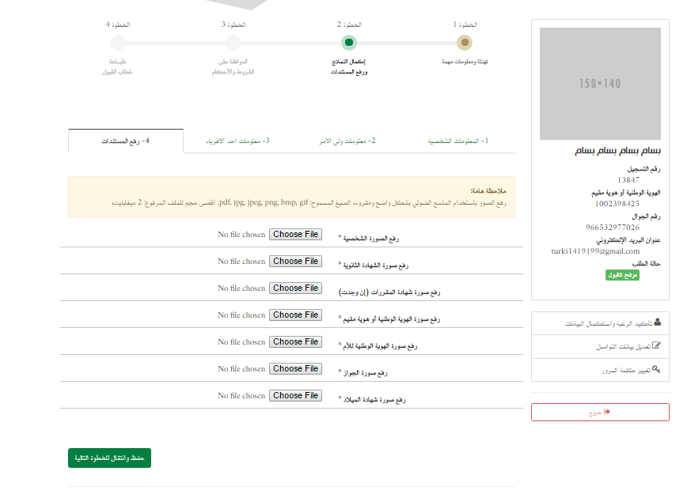

= Software Requirements Specification for Qabool
Information and Communication Technology Center (ICTC), KFUPM
Version 1.0, April 10, 2016: First version
:docinfo1:

include::includes/proprietary-information.adoc[]

[discrete]
== Version History

[cols="1,3,1,3",options="header",small]
|==================================================
| Version | Author(s) | Date      | Change
| 1.0 | Abdullah Joud, Bassam Almaaesh | 2016-04-10 | First version
| 2.0 | Abdullah Joud, Bassam Almaaesh | 2017-01-01 | Update
product functions and business process
| 2.0 | Bassam Almaaesh | 2017-02-15 | Updated business process for phase 1,2,3 and 4
| 2.0 | Bassam Almaaesh | 2017-03-15 | Updated phase 1 screens
| 2.0 | Bassam Almaaesh | 2018-06-15 | added business process for phase 5
| 2.0 | Bassam Almaaesh | 2019-04-10 | added appendix section: student statuses, important dates and all agreements.
|==================================================

[discrete]
== Approvals

[cols="1h,3,1h,1",frame=none,grid=none]
|==================================================
| Name        | Dr. Ahmad Khayyat                    | Role    | Sponsor
| Designation | Assistant Director             | Version | 2.0
| Department  | ICTC                                 | Date    | 2017-04-30
| Phone       | 013860-7270
| Email       | akhayyat@kfupm.edu.sa
|==================================================

[cols="1h,3,1h,1",frame=none,grid=none]
|==================================================
| Name        | Mr. Moawiya Taj | Role    | Client
| Designation | Director General, Admissions| Version | 2.0
| Department  | Admission Office |   Date  | 2017-04-30
| Phone       | 013860-4290
| Email       | moawiya@kfupm.edu.sa
|==================================================

== Introduction

=== Purpose and Intended Audience

The purpose of this document is to give a detailed description
of the requirements for _Qabool_.
It will contain all the details of the requested functionality as well as the wire-frames
that will be used in designing the system. This document is intended to be proposed to
department of admission office for approval. It will also be used as a reference for
the development team while developing the first version of the system.

=== Product Scope

_Qabool_ shall enable students to apply to enroll at KFUPM.
This system will cover the whole admission life-cycle including the following screens

* student application.
* admission screens.
* committee screen.
* student affairs screens.
* registrar office screen.
* English department screens.
* Reception system for orientation week.
* attendance system for university preparation course.
* student housing screens.

=== Definitions, Acronyms, and Abbreviations

[horizontal]
KFUPM::	King Fahd University of Petroleum & Minerals
ITC::	Information Technology Center
ADIS::	Administrative Information System
BI:: Business Intelligence
SMS:: Short Message Service
GSB:: Government Service Bus
Qiyas:: a government entity that conducts admission exams for Saudi universities
Quadrat:: a test conducted by Qiyas to measure a student's skills aptitude level
Tahsili:: a test conducted by Qiyas to asses a student's academic achievement level

=== References

None.

=== Overview of Document

This document is organized as follows: Section 2 gives an overall
description of the system, including the characteristics of its users
and its main functionality. The external interface requirements will be
discussed in Section 3. The functional requirements of the system will
discussed in detail in Section 4. Section 5 explains the other nonfunctional
requirements of the system.

== Overall Description

=== Product Perspective

This system is supposed to be an improvement of an already existing legacy system.
The admission department requested changes to the process and some additional
functionalities and reports.

=== Product Functions

==== Student Functions

* Registration with initial agreement.
* Login, logout, change password & dashboard.
* Student confirmation (only for accepted students by admission office).
And complete information with reading all agreements and upload required documents.
* Withdrawal and agreement (after confirmation the student
  can withdraw anytime).
* Re-upload required documents.
* Assign student KFUPM ID automatically.
* Print documents like admission letter, medical report and two letters that
belong to student housing.
* Search for roommate.
* Choosing student roommate.
* Upload & Re-upload personal picture.
* Reset password.
* Select time to visit building 57.

==== For Admission Office

* Upload list of denied students.
* Create new semester and enter start and end date for each phase.
* Review and correct student information.
* Manage schedule to attend building 57.
* Apply cut-off points and generate results based on student type (S, M and N) and nationality.
* Distribute partial admitted students among committee.
* Calculate and take cut-off points based on student GPAs using business intelligence (BI).
* Change password.

==== For Committee

* Verify student information.

==== For Student Affairs

* Manage schedule for university preparation course.
* Reception system for orientation week in building 57.
* Attendance system for preparation course.

==== For Registrar

* Upload/enter list of KFUPM Student ID.

==== For English Dept.

* Manage schedule for English written and oral exams.

==== BI Reports

Above all, the business intelligence (BI) will provide different type of reports for admission office,
student affairs, registrar office, information and communication technology center.

. Applicants Report	Applicants Report
. Attempters Report
. Brief Applicants Report
. Decision Study Sheet
. Distinguished Student Report
. Missing Info Report
. Nationality ID Error Report
. Registration Statistics Report
. Distinguished Cutoff
. Seats Based Report
. Statistics Report
. Confirmed Students (Admitted)
. Admitted Students Complete Dump
. Awareness Week - Date & Time
. Bank (MADA Card)
. Chronic Diseases
. Distinguished Admitted Students
. Employed Students
. Handicapped Students
. ICTC for Emails
. Khadamati ( Financial Affairs )
. Maqbool (MOE)
. Prep Year
. Register & Student Affairs
. Students with cars information
. Admitted Students by Date
. Withdrawn Students by Date
. Attended Awareness Week
. Not Attended Students
. Student Housing Report
. Student Housing Statistics Report
. Search students information
. Incorrect Names Report
. Missing Documents/Photo Report
. All Applicants
. KFUPM ID's Usage
. Withdrawn Students
. Rejected Problems Students
. Unused KFUPM IDs

==== Business Process

There are four phases in _Qabool_ system.

[[context]]
.Phase one will be the registration phase and it will be open to all high-school students
image::images/businessProcess/1.png[]

[[context]]
.Phase 2 will be student confirmation and completing information
image::images/businessProcess/2.png[]

[[context]]
.Phase 3 printing admission letter, medical report, student housing contracts, other important documents and search for roommate

[[context]]
.Phase 4 Orientation week ( Reception and attendance for preparation course )

[[context]]
.Student withdrawn

=== User Classes and Characteristics

There are six major types of users that interact with the system.

Student::
The student can register, login, check the result in the dashboard,
upload required documents and print important documents.

Admission Administrator::
Admission Administrator can manage and filter students list, manipulate students'
uploaded documents and data entered. Also, he can access to all BI reports and assign user level to the users.

Committee::
Reviewer can review and verify entered students' information and documents and
correct mistakes if any.

Application administrator::
Application administrator can assign and define the roles.

Student affairs::
Student affairs department will have access to some BI reports only.

Registrar::
Registrar office department will have access to some BI reports only.

=== Operating Environment

The system is web-based. All functions shall be available through a web browser.

=== Design and Implementation Constraints

None.

=== Assumptions and Dependencies

_Qabool_ depends on Yesser GSB to fetch students high-school and Quadrat/Tahsili
tests data.

== External Interface Requirements

=== User Interfaces

==== Phase 1: Student Registration
[[context]]
.Qabool Homepage
image::images/phase1/homepage.PNG[]
'''
[[context]]
.Initial Agreements

'''
[[context]]
.Student Registration

'''
[[context]]
.Registration Successfully Message

'''
[[context]]
.Denied Student Message
image::images/phase1/denied_student.png[]
'''
[[context]]
.Error During Registration
image::images/phase1/error_during_registration.png[]
'''
[[context]]
.Student Dashboard after Applying

'''
[[context]]
.Homepage when the registration is closed
image::images/phase1/registration_closed.png[]
'''

==== Phase 2: Student Confirmation

[[context]]
.Rejected Student
image::images/phase2/studentDashboard-Rejected.PNG[]
'''
[[context]]
.Student Confirmation - Partial Admitted

'''
[[context]]
.Student Confirmation - Step1 Agreements
image::images/phase2/StuConfirmation-2.PNG[]
'''
[[context]]

[[context]]

[[context]]
.Student Confirmation - Step2.1 Student Information
image::images/phase2/StuConfirmation-311.PNG[]
'''
[[context]]
.Student Confirmation - Step2.2 Student Information
image::images/phase2/StuConfirmation-4.PNG[]
'''
[[context]]
.Student Confirmation - Step2.3 Student Information
image::images/phase2/StuConfirmation-5.PNG[]
'''
[[context]]
.Student Confirmation - Step2.4 Upload Docs for Saudi Students

'''
[[context]]
.Student Confirmation - Step2.4 Upload Docs for Saudi Mother Students

'''
[[context]]
.Student Confirmation - Step3.1 Student Agreement
image::images/phase2/StuConfirmation-7.PNG[]
'''
[[context]]
.Student Confirmation - Step3.2 Student Agreement
image::images/phase2/StuConfirmation-71.PNG[]
'''
[[context]]
.Student Confirmation - Step3.3 Student Agreement
image::images/phase2/StuConfirmation-72.PNG[]
'''
[[context]]
.Student Confirmation - Step3.4 Student Agreement

'''

==== Phase 3: Print Admission Letter and Medical Report

[[context]]
.Student Confirmation - Print Admission Letter and Medical Report
image::images/phase2/StuConfirmation-8.PNG[]
'''

[[context]]
.Print Admission Letter and Medical Report

'''

[[context]]
.Print Admission Letter
image::images/phase3/admLetter.png[]
'''

[[context]]
.Print Medical Report

'''

[[context]]

.Fill the Questionnaires for student housing

'''

[[context]]
.Search Roommate
image::images/phase3/StudentHousing-Search.PNG[]
'''

==== Phase 4: Orientation Week and Attendance systems

=== Communications Interfaces

- The system must support email and SMS notifications for different activities.
These notifications include:

** Notifying students when the registration has been submitted successfully to admission.
[cols="1,3",options="header",small]
|==================================================
| System Messages  | English | Arabic
| Email Notification  | Dear <student name>,
Your request has been successfully submitted and the Admission results
will be announced on Wednesday June 15, 2016 ...

Registration Details
Registration ID: %(user_id)s
Mobile: %(mobile)s '
Registration Date: %(reg_date)s

You agreed to the following: %(agree_header)s
%(agree_items)s

You are recommended to frequently visit the admission website to know the
admission result and any updated instructions.

Admissions Office,
King Fahd University of Petroleum and Minerals. | [ عزيزي الطالب %(student_name)s, تم استلام طلبك بنجاح
وسيتم إعلان النتائج يوم اﻷربعاء 10 رمضان 1437 هـ حسب تقويم أم القرى  ...

تفاصيل الطلب
رقم التسجيل: %(user_id)s
رقم الجوال: %(mobile)s
تاريخ التسجيل: %(reg_date)s
الشروط و اﻷحكام:

فضلا شارك معنا في اﻻستبيان: http://goo.gl/erw8HQ .

 إدارة القبول،
جامعة الملك فهد للبترول والمعادن.
| SMS Notification  | Your request has been successfully submitted.
We appreciate your feedback: http://goo.gl/erw8HQ.
Admissions Office, KFUPM | تم استلام طلبك بنجاح. فضلا شارك معنا في الاستبيان:
http://goo.gl/erw8HQ .
إدارة القبول، جامعة الملك فهد للبترول والمعادن.
|==================================================

** Notifying students when they confirm and accept study at KFUPM.
** Notifying both application administrator and
students when the withdrawal has been submitted to admission.

== Functional Requirements

=== Students
==== Student Registration

[horizontal]
Capability ID::	Q.01

Description::	This capability allows the student to apply to study at KFUPM.

Rationale:: Students who are interested to study at KFUPM.

Source::	Student.

Fit Criteria::

In addition what we have in the current system in step/phase 1 we should add the following criteria:

. Add new fields called:
.. High School , Qudurat and Tahseel grades.
.. Student Full Name (Arabic) same as Identification ID/Iqama (show this field in student dashboard).
.. Student Full Name (English) same as passport or high school certificate (show this field in student dashboard).
.. Gender, default value is male.
. Add high school types:
.. Private - Public studies
.. Private - International studies.
. Change status message from : ('تم التقديم') to ('تم تقديم طلبك')
. Add note above the form (for best browser use Google Chrome or Firefox).
. Add note below mobile number (to receive a message you have to activate promotion message from your network provider).
. (Deleted) In the student dashboard move up student name and change caption name: "اسم الطالب الثنائي".
. (Deleted) Add new caption/label called gender: only for male.
. Student can edit the following fields till the end of phase 1:
.. Student Full Name Arabic and English.
.. Email and student mobile.
.. High school, Qudurat and Tahseel grades.
.. Student Note

Dependencies::	None.

Conflicts::	None.

Priority::	5

Risk::	1

Effort::	3

Approval::	Not yet approved.

==== Student Confirmation

[horizontal]
Capability ID::	Q.02

Description::	Partial admitted students can make confirmation to study at KFUPM and complete their informations
and also upload required documents including driving license and vehicle registration
documents for security department.

Rationale:: Students who are interested to study at KFUPM can confirm.

Source::	Students.

Fit Criteria::

In addition what we have in the current system step/phase 2, we should add the following criteria:
. Add new field called (do you have a car) and it is optional.
. If yes, the student can enter vehicle registration number and driving license.
. Also, the student can upload these two documents (vehicle registration number and driving license).
. Partial admitted students can upload personal picture and can edit the image using crop, resize and rotate.
. Partial admitted students can not edit their information once they submit the form.
. If partial admitted student doesn't confirm within the period, the system will reject his
application automatically.

Dependencies::	Q.01 and login screen

Conflicts::	None.

Priority::	5

Risk::	3

Effort::	3

Approval::	Not yet approved.

==== Student Reservation and Printing Documents

[horizontal]
Capability ID::	Q.03

Description::	Admitted students can make reservations in order to visit building 54 and also printing
admission letter and medical report.

Rationale:: To attend the orientation week and receive student schedule.

Source:: Students.

Fit Criteria::

In addition what we have in the current system, we move printing admission letter
and medical report to new step/phase 3 add the following criteria:
. This module will be open during step/phase 3.
. Only admitted students can access the system in order to make a reservation to visit building 54.
. Admitted student can not change the reservation once he select and submit form.
. The system will assign KFUPM ID to the student automatically once he make reservation.
. Admitted students can print admission letter after he select the reservation.
. Admitted students can print medical report.
. The admission letter contains the time-slot to visit building 54.

Dependencies::	login screen and Q.09

Conflicts::	None.

Priority::	5

Risk::	3

Effort::	3

Approval::	Not yet approved.

==== Find roommate

[horizontal]
Capability ID::	Q.04

Description::	Admitted students who are eligible for housing can search and select a roommate.

Rationale:: To search and find roommate.

Source::	Students.

Fit Criteria::
In addition what we have in the current system step/phase 3, we should add the following criteria:
. This module will start in step/phase 3 after printing admission letter and it will close before orientation week.
. Admitted student can answer the questionnaire.
. Add a new field called "Enter Your Partner KFUPM ID" to send a request to the partner.
. The roommate should be able to accept or reject the request.
. If both students agree, their information will not show in the search page.

Dependencies::	login screen , Q.03 and Q.09.

Conflicts::	None.

Priority::	4

Risk::	3

Effort::	3

Approval::	Not yet approved.

==== Student Withdrawn

[horizontal]
Capability ID::	Q.05

Description::	Admitted students have the opportunity to withdraw from the university.

Rationale:: Admitted students not interested to study at KFUPM.

Source::	Students.

Fit Criteria::
In addition what we have in the current system step/phase 3, we should add the following criteria:
. This module will start in step/phase 3 after student confirmation and printing documents.
. The last day for students to withdraw will be the end of the registration period.
. Once the student withdrawal is processed, the system will remove his KFUPM
ID and it will not be used in the system again.
. The system will send SMS notification to the student and his parent once he confirm and submit the form.

Dependencies::	login screen , Q.03 and Q.09.

Conflicts::	None.

Priority::	4

Risk::	3

Effort::	3

Approval::	Not yet approved.

=== Registrar

==== Upload KFUPM IDs

[horizontal]
Capability ID::	Q.06

Description::	The registrar should be able to upload KFUPM IDs in the current semester.

Rationale:: These KFUPM IDs will distribute to Admitted students and it will assign to them
random and automatically.

Source::	Registrar.

Fit Criteria::
. The registrar should be able to upload list of KFUPM IDs in the specific semester.
. All KFUPM IDs should be uniques.

Dependencies::	login screen.

Conflicts::	None.

Priority::	5

Risk::	3

Effort::	3

Approval::	Not yet approved.

=== English Department

==== Upload English results
[horizontal]

Capability ID::	Q.07

Description::	The English department should be able to upload the results of English written exam
for current semester.

Rationale:: For statistic purpose and the report will create through BI.

Source::	English Department.

Fit Criteria::
. English department will able to upload list of student results.
It contains only two fields (student ID and student level) for the current year/semester.

Dependencies::	who-attend-orientation-week and take English exam

Conflicts::	None.

Priority::	1

Risk::	1

Effort::	1

Approval::	Not yet approved.

==== Manage Written Exam and Interview Time-slot
[horizontal]

Capability ID::	Q.08

Description::	The English department can manage written exam and
interview for current semester in order to use it in step/phase 4.

Rationale:: To use it in the orientation week and print the schedule for the students in the reception.

Source::	English Department.

Fit Criteria::
. English department should able to add exam dates and sections information in the current semester
(note: usually they schedule only for two dates).
// And the fields are date and day.

// . Each date has many sections information ( the fields are : building number, section number,
//   maximum enrollment, interview start time, interview students per 10 minutes).

Dependencies::	None.

Conflicts::	None.

Priority::	5

Risk::	3

Effort::	3

Approval::	Not yet approved.

==== BI Reports

Fit Criteria::

. Display list of students per section for English exam and Interview.

=== Committee

==== Review and Verification Student Information
[horizontal]

Capability ID::	Q.09

Description::	The committee can view student's information and correct it if need.
It starts on the second day of step/phase 2.

Rationale:: To verify student's information.

Source::	Committee.

Fit Criteria::
. This module will open on second day of step/phase 2 once the student submit his application.
. Committee should be able to correct student full names bilingual (only full names).
. All fields should be "read only" except
.. full names
.. high school name, province, high school city, country,
.. eligible for housing,
.. expire Gov ID / Iqama and
.. birth of date and place
.. committee note and type of the problems.
. Committee should be able to review and verify student information.
. Committee should be able to remove/delete student's documents if any document is missing and it will go back to
the student in order to correct and re-upload the documents.
. Committee should be able to remove the student's picture and return back to student in order to re-upload it.
. The system should be able to assign KFUPM ID automatically (student ID)
if the application is valid.
. If the student not respond to correct his application during second step/phase 2,
his application will be rejected.

// And the fields are date and day.
// . Each date has many sections information ( the fields are : building number, section number,
//   maximum enrollment, interview start time, interview students per 10 minutes).

Dependencies::	Q.01 , Q.03 and login screen.

Conflicts::	None.

Priority::	5

Risk::	3

Effort::	3

Approval::	Not yet approved.

=== Admission Office

==== Manage Admission Time-slot
[horizontal]
Capability ID:: Q.10

Description::	The admission office can manage the time-slot in order to allow admitted students
to select proper time to attend orientation week and then print the admission letter.

Rationale:: To organize scheduling for the orientation week.

Source::	Admission Office.

Fit Criteria::
. Admission office should be able to add time-slot in order to organize
the schedule for the orientation week. (note: usually they schedule
only for two days and 8 time-slots).
. These slots only for admitted students.

Dependencies:: Q.09.

Conflicts::	None.

Priority::	5

Risk::	3

Effort::	3

Approval::	Not yet approved.

==== Sync Data from Yesser
[horizontal]
Capability ID:: Q.11

Description::	The admission office can retrieve data from Yesser in order to calculate students GPAs.

Rationale:: To calculate student GPAs.

Source::	Admission Office.

Fit Criteria::
. Admission office should be able to retrieve student information from Yesser.
.. Student Arabic name separated.
.. Student English name separated.
.. (another new fields especially for Yesser) High School , Qudurat and Tahseel grades.
.. High school name, province and city.
.. Birth of date and place.
.. Gender

Dependencies:: Q.01.

Conflicts::	None.

Priority::	5

Risk::	3

Effort::	3

Approval::	Not yet approved.

==== Apply Cut-Off Points
[horizontal]
Capability ID:: Q.12

Description::	The admission office can apply cut-off points based on students GPA
and their types (S, M and N ) and student nationalities.

Rationale:: To announce student results and nominate partial admitted.

Source::	Admission Office.

Fit Criteria::
. Admission office should be able to apply cut-off points based on students GPA student type
(S, M and N), graduation year, high school types and nationality.

Dependencies:: Q.09.

Conflicts::	None.

Priority::	5

Risk::	3

Effort::	3

Approval::	Not yet approved.

==== BI Reports
We should enhance and update current reports based on the new capabilities.

=== Student Housing

==== BI Reports

Fit Criteria::

. Display list of eligible students for housing and their status if they find a roommate or not yet.

=== Student Affairs

==== Reception System (in Building 54)
[horizontal]
Capability ID:: Q.13

Description::	This capability will allow the student affairs to print schedule for English exams and
preparation university course. And then give two copies: one for student and the other will print inside for student affairs.

Rationale::	In order to get student folder and schedule English exams and preparation university course.

Source::	Student Affairs.

Fit Criteria::

. The system will schedule only for admitted students.
. Student affairs should be able to enter student ID in order to print schedule for English exams and the course time and location.
. The system should schedule course time without any conflicts with English written exams and interview.
. If the student does not visit building 54 and print his scheduled exams and course,
he cannot attend the course of preparation university course.

Dependencies:: Q.03

Conflicts::	None.

Priority::	5

Risk::	3

Effort::	3

Approval::	Not yet approved.

==== Attendance System for Preparation Course
[horizontal]
Capability ID:: Q.14

Description::	This capability will allow the staff of student affairs to record
attendance for the students based on their schedule.

Rationale::	In order to attend the course and after that the students can receive books from bookstore.

Source::	Student Affairs.

Fit Criteria::

. Student affairs should be able to make attendance of each student per section.
. If the student does not visit building 54 and print his scheduled exams and course,
he cannot attend the course of preparation university course.
. If the student does not attend preparation course, the system will not allow him to receive books from bookstore.

Dependencies::	Q.12

Conflicts::	None.

Priority::	5

Risk::	3

Effort::	3

Approval::	Not yet approved.

==== BI Reports

Fit Criteria::

. Display list of students per section for preparation course.
. Display list of students who did not attend the course.
. Display list of students who attend orientation week and who did not.

=== Security Department

==== BI Reports

Fit Criteria::

. Display list of students who want to get car stickers with vehicle information.

== Other Nonfunctional Requirements

[[PerReq]]

=== Performance Requirements

* The web application should be hosted on a cloud service that should guarantee
99.9% uptime. In addition, The response time must be less than 5 seconds for all
 users' interactions
* The web application must support 1,000+ concurrent requesters which will on
a busy day generate 10,000+ interaction.

=== Safety Requirements

None.

=== Security Requirements

Since this system handles sensitive and mission-critical data, it should provide
tight data security that shall prevent direct and unauthorized access. Penetration testing
should be conducted (by third-party if possible) to assure that.

=== Software Quality Attributes

==== Portability

The web application should work on all major hand-held devices including
smart-phones and tablets. This should be achieved by using responsive user interface
that shall scale gracefully according to display screen size.

==== Reliability & Availability

Since this system is mission-critical to KFUPM, it should be hosted on reliable
hosting service that can fulfill <<PerReq,Performance Requirements>> stated above.
Moreover, system data must be backed up every day twice and the backup copies should be
stored at different physical location for disaster recovery.

==== Scalability

This system will be hosted on a cloud service to provide better performance. Hence,
the system should be designed and implemented to be cloud-ready. Stress testing should
be conducted (by third part if possible) to assure this.

==== Usability

Since this web application will be used by a large number of end-users from various
backgrounds, it should be user-friendly. The screen layouts should be trivial.
Field names should be clear and unambiguous and hints/tips should be
provided inline to explain complicated tasks required from users whenever necessary.

== Other Requirements

The web application should have bilingual user interface that can be used to
switch the display language at any time by the end-user. The layout should change
according to the display language between RTL and LTR.

[appendix]
== Important Dates
[.arabic]

تواريخ هامة (حسب تقويم أم القرى)

==================================================
    فترة التسجيل : (1 ظهراً) الخميس 16 رمضان 1439هـ إلى (1 ظهراً) الأربعاء 22 رمضان 1439هـ
    إعلان النتائج : (1 ظهراً) الخميس 14 شوال 1439هـ
    تأكيد التسجيل : (1 ظهراً) الخميس 14 شوال 1439هـ إلى (1 ظهراً) الاثنين 18 شوال 1439هـ
    طباعة خطاب القبول والكشف الطبي : (1 ظهراً) الثلاثاء 26 شوال 1439هـ إلى (1 ظهراً) السبت 1 ذوالقعدة 1439هـ
    البحث عن زميل السكن : الأحد 1 ذوالحجة 1439هـ إلى الخميس 26 ذوالحجة 1439هـ
    البرنامج التعريفي للطلاب المستجدين : الحضور الزامي حسب الموعد المحدد في خطاب القبول ويستمر البرنامج إلى الخميس 19 ذوالحجة 1439هـ
==================================================

[appendix]
== Agreements

=== Phase 1 Agreements

Before creating an account in phase 1.

==== English Version

==================================================
Dear student,

Assalamu Alaikum

WARNING: TODO: Review!

Assalamu Alaikum

Deanship of Admission and Registration at King Fahd University of Petroleum and Minerals congratulates you on the completion of High School and wish you a successful undergraduate students life. To enroll in the King Fahd University of Petroleum and Minerals for the academic year 1439/1440 H, the following points to be noted:

    - You, the student, are fully responsible for the accuracy and validity of all of the information that you will provide in this application.

    - Admission office will receive students’ scores directly from the Ministry of Education and the National Center for Assessment in Higher Education (Qiyas).

    - The registration period from Thursday 31 May, 2018 to Wednesday 6 June, 2018.

    - Admission results will be announced on Thursday 14 June, 2018.

    - The admission website is the main reference for the announcement of the result of the application for acceptance and the new instructions, so the applicant has the responsibility to follow the admissions website.

    - Candidates will receive text message on their registered mobile number.

    - Nominated applicants have to complete phase two of the online application and upload the required documents during the period of: Thursday, 14 July 2018 to Monday, 10 July 2018.

    - Nominated applicants have to print their admission Letter & Medical Checkup Form during the period of: Tuesday, 10 July 2018 to Saturday 14 July 2018.

    - Attending the awareness week is mandatory for all admitted students (according to the schedule for each student in his admissions letter) during the period from Monday 27 August, 2018 to Thursday 23 August, 2018.

    - Classes will start on Sunday 2 September, 2018

==================================================

==== Arabic Version

التعهدات والاقرارات عند التسجيل في المرحلة اﻷولى.

[.arabic]
==================================================

عزيزي الطالب

السلام عليكم ورحمة الله وبركاته

يطيب لعمادة القبول والتسجيل بجامعة الملك فهد للبترول والمعادن أن تهنئك بتخرجك من المرحلة الثانوية متمنين لك حياة دراسية موفقة في المرحلة الجامعية. و في حال كانت لديكم الرغبة في الإلتحاق بجامعة الملك فهد للبترول والمعادن للعام الدراسي 1439 / 1440 هـ ، نأمل منكم الإطلاع على النقاط التالية:

- التأكد من دقة وصحة جميع البيانات المدخلة مسؤولية الطالب الكاملة.

- تحصل ادارة القبول في الجامعة مباشرة على نتائج الطالب في الثانوية (وزارة التعليم) و اختبارات القدرات و التحصيلي (المركز الوطني للقياس).

- التقدم بطلب إلتحاق إلكتروني خلال الفترة من يوم الخميس 16 رمضان 1439هـ الموافق 31 مايو 2018م ( 1 ظهراً ) إلى يوم الأربعاء 22 رمضان 1439هـ الموافق 6 يونية 2018م ( 1 ظهراً ).

- تعلن نتائج المرشحين للقبول يوم الخميس 14 شوال 1439هـ الموافق 28 يونية 2018م ( 1 ظهراً ).

- يعتبر الموقع الالكتروني لادارة القبول المرجع الرئيس للإعلان عن درجة القبول و التعليمات المستجدة و بذلك تقع على الطالب المتقدم مسؤولية متابعة الموقع الالكتروني.

- ترسل نتائج القبول للمتقدمين إلى جوال الطالب المسجل في طلب التسجيل الالكتروني.

- في حال تم قبول ترشيح الطالب للجامعة ولديه الرغبة الكاملة في الدراسة بها، يجب عليه أن يؤكد ذلك وأن يستكمل البيانات اللازمة ورفع المستندات المطلوبة من خلال الموقع الإلكتروني لإدارة القبول خلال الفترة من يوم الخميس 14 شوال 1439هـ الموافق 28 يونية 2018م ( 1 ظهراً ) إلى يوم الاثنين 18 شوال 1439هـ الموافق 2 يولية 2018م ( 1 ظهراً ).

- يجب على الطالب طباعة خطاب القبول والكشف الطبي من خلال الموقع الإلكتروني لإدارة القبول خلال الفترة من يوم الثلاثاء 26 شوال 1439هـ الموافق 10 يولية 2018م ( 1 ظهراً ) إلى يوم السبت 1 ذوالقعدة 1439هـ الموافق 14 يولية 2018م ( 1 ظهراً ).

- حضور البرنامج التعريفي إلزامي على جميع الطلاب (حسب الموعد الذي حدده الطالب في خطاب القبول) خلال الفترة من يوم الاثنين 16 ذوالحجة 1439هـ الموافق 27 اغسطس 2018م إلى يوم الخميس 19 ذوالحجة 1439هـ الموافق 30 اغسطس 2018م.

- تبدأ الدراسة الجامعية يوم الأحد 22 ذو الحجة 1439هـ الموافق 2 سبتمبر 2018م.

==================================================

=== Phase 2 Agreements

Admitted students for S and M (Saudi and Saudi mother).

==== English Version
[.english]
==================================================

WARNING: TODO: Translate to English!

==================================================

==== Arabic Version
[.arabic]
التعهدات والاقرارات في المرحلة الثانية للطلاب السعوديين ومن أمهات سعوديات

==================================================

عزيزي الطالب:

السلام عليكم ورحمة الله وبركاته

يطيب لعمادة القبول والتسجيل بجامعة الملك فهد للبترول والمعادن أن تهنئك بالقبول في الجامعة للعام الدراسي 1438 / 1439 هـ متمنين لك حياة دراسية موفقة، ونود أن نؤكد على أهمية النقاط التالية:

فعاليات الأسبوع التعريفي:

* اختبار مستوى اللغة الانجليزية.

* دورة التهيؤ للدراسة والحياة الجامعية.

* انهاء الاجراءات المتعلقة باستلام:

** الجدول الدراسي
** الكتب الدراسية
** البطاقة الجامعية
** البطاقة البنكية
** السكن الجامعي

حضور فعاليات البرنامج التعريفي "إلزامي على جميع الطلاب"، وذلك حسب الموعد المحدد لي في خطاب القبول خلال الفترة من يوم الاثنين 20 ذو الحجة 1438هـ الموافق 11 سبتمبر 2017م إلى يوم الخميس 23 ذو الحجة 1438هـ الموافق 14 سبتمبر 2017م، ويلزمني عند الحضور للجامعة:

* احضار خطاب القبول
* احضار الكشف الطبي
* صورة الكشف الأصلي لدرجات الثانوية العامة (علوم طبيعية) أو صورة الكشف الأصلي لدرجات الثانوية نظام المقررات (علوم طبيعية) + صورة شهادة اتمام الدراسة
* صورتان حديثتان ملونتان للطالب ( بالزي السعودي -- خلفية الصورة بيضاء -- بدون نظارة )
* للطلاب السعوديين: صورة بطاقة الهوية الوطنية
* للطلاب غير السعوديين ومن أمهات سعوديات:
.. أصل و صورة إقامة الطالب
.. أصل و صورة جواز سفر للطالب
.. أصل و صورة الهوية الوطنية لوالدة الطالب
.. أصل و صورة شهادة ميلاد الطالب

يلغى قبول الطلاب الذين تم إبلاغهم بالقبول ولم يؤكدوا الرغبة بالالتحاق بالجامعة ولم يستكملوا بياناتهم ولم يرفعوا المستندات المطلوبة في الموعد المحدد لهم عند إعلان النتائج.

إذا كان لديك قبول في جامعة أو كلية أخرى، أو سبق لك تأكيد رغبتك في الالتحاق بجامعة أخرى، وترغب في الدراسة في جامعة الملك فهد للبترول والمعادن ، فينبغي عليك الانسحاب والحصول على اخلاء طرف من تلك الجهة وارساله مع صورة الهوية الوطنية إلى البريد الالكتروني admissions@kfupm.edu.sa، مع ضرورة كتابة اسم الطالب ورقم التسجيل في الجامعة ورقم الهوية الوطنية في نفس الرسالة.

==================================================

التعهدات والاقرارات في المرحلة الثانية للطلاب غير السعوديين

التعهدات والاقرارات في المرحلة الثانية للطلاب المحولين

==================================================

عزيزي الطالب ..

السلام عليكم ورحمة الله وبركاته

يطيب لعمادة القبول والتسجيل بجامعة الملك فهد للبترول والمعادن أن تهنئك بالقبول في الجامعة للعام الدراسي 1439 / 1440 هـ متمنين لك حياة دراسية موفقة، ونود التأكيد على أهمية الإطلاع و التقيد بالنقاط التالية:

* عليك تعبئة نموذج الفحص الطبي المرسل اليك وذلك بمراجعة أقرب مستشفى أو مستوصف حكومي أو خاص
* ينبغي عليك تعبئة البيانات بكل دقة وأمانة وعلى مسؤوليتك الشخصية كما ينبغي عليك رفع المستندات المطلوبة وصورتك الشخصية بشكل كبير وواضح (لابد ان تكون ممسوحة ضوئياً scan )

* الحضور للجامعة الزامي وشخصي، ينبغي على الطالب مراجعة إدارة القبول (مبنى رقم 68 مكتب 237) يوم الثلاثاء 17 ذو الحجة 1439هـ الموافق 28 اغسطس 2018م ( الساعة 9 صباحا ) لاستلام خطاب القبول ، وينبغي احضار المستندات التالي:
** أصل بطاقة الهوية الوطنية
** نموذج الفحص الطبي
** عدد 2 صور شخصيه بالزي السعودي والخلفية بيضاء وبدون نظارات

==================================================

=== Phase 3 Agreements

Admitted students for S and M (Saudi and Saudi mother).

==== English Version
[.english]
==================================================

WARNING: TODO: Translate to English!

==================================================

==== Arabic Version
[.arabic]

التعهدات والاقرارات في المرحلة الثالثة للطلاب السعوديين ومن أمهات سعوديات

==================================================
أقر بما يلي:
. أقر أن علي معرفة جميع الانظمة والتعليمات المتعلقة بالجوانب الاكاديمية وغير الاكاديمية طوال مسيرتي الدراسية في الجامعة.

. أقر أني اطلعت على دليل الطالب (للتحميل اضغط <a href="" target="_blank">هنا</a>)  والتزم بكل ما ورد فيه، بما في ذلك:
.. كافة الجوانب الاكاديمية
.. دليل الحقوق والواجبات للطالب الجامع
.. أنظمة سكن الطلاب
.. أنظمة الأمن والسلامة المرورية
.. أنظمة الصحة والسلامة
.. أنظمة شكبة الحاسب الالي وتقنية المعلومات والبريد الالكتروني
.. نظام مكافأة الطلاب، وأتعهد بأنني في حال عدم الإستفادة من المكافأة أو في حال الإبقاء على رصيد 990 ريالاً أوأكثـر لمدة 90 يوماً أو أكثـر، فإني أفوض عمادة شؤون الطلاب بسحبها وإرجاعها لحساب صندوق الطلاب حسب اللائحة المنظمة لمكافآت الطلاب. وعليه ليس لي حق الاعتـراض أو المطالبة بالمبلغ حال تحويله.
.. المحافظة على ممتلكات ومنشآت ومرافق الجامعة.

ألتزم الصدق والأمانة ومبادئ الأخلاق السوية، وألا أقوم بالغش أو التزوير أو الانتحال أو بأي أعمال مخلة بالأخلاق الإسلامية والآداب العامة والأعراف الجامعية
==================================================

التعهدات والاقرارات في المرحلة الثالثة للطلاب غير السعوديين

==================================================

   عزيزي الطالب المستجد.. نتقدم لك بخالص التهنئة لقبولك في جامعة الملك فهد للبترول والمعادن ضمن برنامج المقاعد الدراسية برسوم , ونتمنى لك التوفيق و النجاح، و نود التأكيد على أهمية الإطلاع و التقيد بالنقاط التالية:

* برنامج المقاعد الدراسية برسوم متاح للطلاب غير السعوديين الحاصلين على درجة مركبة متميزة تقرها لجنة قبول الطلاب المستجدين على أن تكون لدى الطالب بطاقة هوية مقيم سارية المفعول.
* لايحق للطالب في أي مرحلة من مراحل دراسته الجامعية التقدم بطلب الحصول على بطاقة إقامة تابعة للجامعة.
* يخضع طلاب البرنامج للائحة الدراسة والاختبارات والقواعد التنفيذية الخاصة بجامعة الملك فهد للبترول والمعادن، وكذلك لائحة ضبط سلوك الطلاب.
* ألتزم الصدق والأمانة ومبادئ الأخلاق السوية، وألا أقوم بالغش أو التزوير أو الانتحال أو بأي أعمال مخلة بالأخلاق الإسلامية والآداب العامة والأعراف الجامعية.
* أقر أني سوف اطلع على دليل الطالب والتزم بكل ما ورد فيه، بما في ذلك:
** كافة الجوانب الاكاديمية ،
** دليل الحقوق والواجبات للطالب الجامعي ،
** أنظمة سكن الطلاب ،
** أنظمة الأمن والسلامة المرورية ،
** أنظمة الصحة والسلامة ،
** أنظمة شبكة الحاسب الآلي وتقنية المعلومات والبريد الالكتروني ،
** المحافظة على ممتلكات ومنشآت ومرافق الجامعة.

* أقر أن علي معرفة جميع الانظمة والتعليمات المتعلقة بالجوانب الاكاديمية وغير الاكاديمية طوال مسيرتي الدراسية في الجامعة.

==================================================

التعهدات والاقرارات في المرحلة الثالثة للطلاب السعوديين ومن أمهات سعوديات

* الترقية في اللغة الانجليزية
==================================================

    - يتطلب إجتياز برنامج اللغة الإنجليزية في السنة التحضيرية تحقيق تقدير لا يقل عن جيد (C) في أربعة مقررات (انجليزي01، انجليزي 02، انجليزي03، انجليزي04) مدة كل منها نصف فصل دراسي، علماَ بأن الطالب يستطيع إنهاء مقررين خلال الفصل الدراسي الواحد، وبالتالي يمكنه إنهاء مقررات اللغة الانجليزية خلال فصلين دراسيين.

    - سيعقد قبل بدء الدراسة اختبار تحديد المستوى للطالب المستجد وبناءً على نتيجة الاختبار يتم تحديد المقرر الذي سيبدأ به دراسة اللغة الانجليزية.
    فإذا كان مستوى الطالب أعلى من المقرر الأول (انجليزي01) فسيُلحق بالمقرر الأعلى و بالتالي يمكنه تقليص الوقت المطلوب لإنهاء متطلبات اللغة الإنجليزية.
    وإذا كان مستواه لا يؤهله للمقرر الأول فسيُلحق الطالب بمقرر (انجليزي00)، وفي هذه الحالة يتعين على الطالب إنهاءه مع المقررات الأربعة المذكورة ضمن المدة المحددة للسنة التحضيرية، مما قد يتطلب فصلاً دراسيا إضافياً.

    - يجب على الطالب تحقيق درجة (500) بحد أدنى في اختبار اللغة الانجليزية (التوفل) و الذي يعقد في نهاية مقرر (انجليزي 04)، و في حال لم يحقق تلك الدرجة يلزم الطالب بحضور مقرر أو أكثر من مقررات اللغة الانجليزية حتى يحقق الدرجة المطلوبة (500).

==================================================

[.arabic]

التعهدات والاقرارات في المرحلة الثالثة للطلاب السعوديين ومن أمهات سعوديات

* اجتياز السنة التحضيرية
==================================================

عزيزي الطالب المستجد ..
نتقدم لك بخالص التهنئة لقبولك في جامعة الملك فهد للبترول والمعادن و نتمنى لك التوفيق و النجاح، ونود إفادتك بالشروط المهمة المتعلقة باجتياز السنة التحضيرية وهي:

- القبول يكون لبرنامج السنة التحضيرية وفي حالة اجتيازها بنجاح فيتم انتقال الطالب إلى المرحلة الجامعية.

- مدة الدراسة في برنامج السنة التحضيرية عام دراسي واحد، وقد تتيح الجامعة للطالب فصلاً دراسياً إضافياً واحداً لإنهاء متطلبات البرنامج

- اجتياز برنامج السنة التحضيرية يتطلب تحقيق مايلي:
        اجتياز جميع مقررات اللغة الإنجليزية، ومقرري الرياضيات بتقدير لايقل عن جيد ((C في كل واحد من هذه المقررات.
        اجتياز بقية مقررات برنامج السنة التحضيرية الأخرى بتقدير لا يقل عن مقبول (D) في كل واحد منها، وهي: (علوم طبيعية، علوم حاسب، مهارات جامعية، تقنيات هندسة، مقرري التربية البدنية)

- يفصل الطالب نهائياً من برنامج السنة التحضيرية ولا يجوز له العودة إلى الجامعة، وذلك في إحدى الحالات التالية:
        حصول الطالب على تقدير أقل من جيد (C) بما مجموعة ثلاث مرات في مقررات اللغة الإنجليزية (سواءً كان ذلك في مقرر واحد أو عدة مقرارات).
        حصول الطالب على تقدير أقل من جيد (C) مرتين متتاليتين في أحد مقررات الرياضيات.
        عدم إنهاء الطالب جميع مقررات برنامج السنة التحضيرية خلال مدة أقصاها ثلاثة فصول دراسية.

- لا يسمح للطالب المفصول من برنامج السنة التحضيرية العودة للجامعة إذا رغب في إنهاء ما تبقى عليه من مقررات في كلية المجتمع بالدمام التابعة لجامعة الملك فهد للبترول والمعادن.

- لايسمح للطالب أثناء الدراسة في برنامج السنة التحضيرية التأجيل أو الانسحاب، وفي حالة قيام الطالب بذلك فيسقط حقه في العودة للجامعة.

==================================================

[.arabic]

التعهدات والاقرارات في المرحلة الثالثة للطلاب السعوديين ومن أمهات سعوديات

* اختيار التخصص
==================================================

عزيزي الطالب المستجد
تعنى الجامعة بمساعدة الطالب في إختيار تخصصه الجامعي الذي يلائم قدراته و رغباته، لذا تقام العديد من الفعاليات المتنوعة خلال برنامج السنة التحضيرية، يتم من خلالها تعريف الطالب المستجد بتخصصات الجامعة و كذلك مساعدته للتعرف على ميوله تجاه هذه التخصصات. وحيث أنه لكل تخصص أكاديمي طاقة إستيعابة يتم تحديدها بناءً على معايير تضمن جودة التعليم، لذا تم وضع آليات تضمن تحقيق رغبة الطالب المستجد في إختيار التخصص قدر الإمكان مع مراعاة العدالة و الشفافية.

آليات اختيار التخصص:

** طالب منحة داخلية
** طالب منحة خارجية
** طالب مقعد راسي برسوم

    إذا اجتاز الطالب برنامج السنة التحضيرية ، فيحق له اختيار التخصص الذي
 يرغبه وفق المعايير المعلنة في موقع أدارة القبول الإلكتروني
    http://www.kfupm.edu.sa/departments/admissions

==================================================

[appendix]
== Student Housing Agreements

[.arabic]

=== Housing agreements:

==================================================
نأمل الاطلاع واتباع التعليمات التالية:

* سيتم تحديد رقم العمارة والغرفة من خلال النظام الإلكتروني بشكل آلي.
* الاطلاع على إقرار وتعهد السكن وطباعته.
* طباعة عدد نسختين من نموذج عقد السكن لكل طالب.
* طباعة عدد نسختين من نموذج التسكين لكل طالب.
* في حالة انسحاب أحد الطالبين المتقدمين بطلب السكن، سيتم إلغاء الطلب واسترجاع الغرفة تلقائيًا. ويلزم على الطرف الآخر تقديم طلب سكن مع زميل آخر.
* إذا كنت ترغب في تغيير السكن، يمكنك تقديم طلب بعد شهر من بداية الفصل الدراسي الأول إلى الإدارة العامة لإسكان الطلاب.
==================================================

=== Awareness Week Agreements:

==================================================
ملاحظات مهمة:

* حضور جميع فعاليات البرنامج التعريفي إلزامي على جميع الطلاب
* حدد الموعد المناسب لك لحضور البرنامج التعريفي وسوف يستمر البرنامج التعريفي إلى يوم الخميس 19 ذوالحجة 1439هـ الموافق 30 أغسطس 2018م
* لا يمكنك تغيير الموعد بعد التحديد
* ينبغي عليك طباعة خطاب القبول والكشف الطبي خلال الفترة من الثلاثاء 26 شوال 1439هـ الموافق 10 يولية 2018م (1 ظهراً) إلى السبت 1 ذوالقعدة 1439هـ الموافق 14 يولية 2018م (1 ظهراً)
* عليك انهاء الفحص الطبي في المدينة التي تقيم فيها وفي أقرب مستوصف أو مستشفى حكومي أو خاص
* عليك الحضور في موعدك للبرنامج التعريفي مع إحضار خطاب القبول والكشف الطبي وصورة الهوية الوطنية وصورة شهادة الثانوية وصورتين شخصية حديثة ملونة وبالزي السعودي

* مقر البرنامج التعريفي: مبنى السنة التحضيرية (مبنى 57) بجوار مجمع الجامعة في سكن الطلاب
* سوف تبدأ الدراسة في الجامعة  للعام 1439 / 1440 هـ يوم الأحد 22 ذوالحجة 1439هـ الموافق 02 سبتمبر 2018م

?????????????????

* انهاء الفحص الطبي في المدينة التي تقيم فيها (في أقرب مستوصف أو مستشفى حكومي أو خاص)
* حضور اللقاء التعريفي لطلاب برنامج مقعد دراسي برسوم (مبنى 59 – قاعة 1001 ) يوم الإثنين 16 ذو الحجة 1439هـ الموافق 27 أغسطس 2018م (الساعة 8:30 صباحاً) للإطلاع على الأنظمة الخاصة بالرسوم الدراسية و المزايا المتعلقة بالبرنامج واستلام خطاب القبول
* حضور جميع فعاليات البرنامج التعريفي إلزامي على جميع الطلاب شخصياً، والذي يبدأ يوم الثلاثاء 17 ذو الحجة 1439هـ الموافق 28 أغسطس 2018م  (ا ظهراً) و يستمر البرنامج إلى يوم الخميس 19 ذوالحجة 1439هـ الموافق 30 أغسطس 2018م
* احضار المستندات التالية:
** الكشف الطبي .
** أصل وصور المستندات التالية (هوية مقيم - جواز السفر - شهادة الميلاد) .
** صورة الشهادة الثانوية .
** صورتان شخصية حديثة ملونة والخلفية بيضاء وبدون نظارات .
** صورة إقامة ولي أمر الطالب .
** خطاب تعريف من جهة عمل ولي الأمر

* مقر البرنامج التعريفي: مبنى السنة التحضيرية (مبنى 57) بجوار مجمع الجامعة في سكن الطلاب
* تبدأ الدراسة في الجامعة  للعام الدراسي 1439 / 1440 هـ يوم الأحد 22 ذوالحجة 1439هـ الموافق 02 سبتمبر 2018م
==================================================

=== Housing Roommate Request Agreements

==================================================
نأمل الاطلاع واتباع التعليمات التالية:

* سيتم تحديد رقم العمارة والغرفة من خلال النظام الإلكتروني بشكل آلي.
* الاطلاع على إقرار وتعهد السكن وطباعته.
* طباعة عدد نسختين من نموذج عقد السكن لكل طالب.
* طباعة عدد نسختين من نموذج التسكين لكل طالب.
* في حالة انسحاب أحد الطالبين المتقدمين بطلب السكن، سيتم إلغاء الطلب واسترجاع الغرفة تلقائيًا. ويلزم على الطرف الآخر تقديم طلب سكن مع زميل آخر.
* إذا كنت ترغب في تغيير السكن، يمكنك تقديم طلب بعد شهر من بداية الفصل الدراسي الأول إلى الإدارة العامة لإسكان الطلاب.
==================================================

=== Housing Roommate Search Instructions

==================================================
عزيزي الطالب المستجد.

السلام عليكم ورحمة الله وبركاته..

ترحب بك الإدارة العامة لاسكان الطلاب في هذا الموقع الخاص بمساعدة الطلاب المستجدين المستحقين للسكن الجامعي للبحث عن زميل السكن المناسب

يتيح لك هذا الموقع اختيار زميل السكن المناسب، من خلال المعلومات التي ستظهر لك ولزملاء آخرين يبحثون هم كذلك عن زميل للسكن.

طريقة عمل الموقع:

* يتيح لك الموقع الاطلاع على معلومات شخصية وأخرى إضافية عن الطلاب المستجدين الذين يبحثون عن زميل للسكن.
* يمكنك البحث في الموقع من خلال عنصر بحث واحد أو أكثر (المدينة، المدرسة، موعد النوم ...).
* لمزيد من المعلومات يمكنك التواصل مع من ترغب في السكن معه على وسائل التواصل الخاصة
* تفادياً للإزعاج وكثرة الاتصالات عند الاتفاق مع زميل السكن المناسب، فعليك معاودة تسجيل الدخول في هذا الموقع، و اختيار (لا) في سؤال ( هل تبحث عن زميل سكن؟ * ) بحيث يتم تلقائيًا إزالة معلوماتك من قائمة الباحثين عن زميل السكن.
* إذا لم تجد زميلاً مناسباً عاود الدخول مرة أخرى، حيث أنه سيزداد عدد الطلاب المسجلين في الموقع مما يتح لك مزيد من الاختيارات.
* ستحتاج للحصول على الرقم الجامعي لزميل السكن الذي اتفقت معه لاستكمال اجراءات الحصول على السكن الجامعي.
==================================================

=== Housing Roommate Request Instructions

==================================================
نأمل الاطلاع واتباع التعليمات التالية:

* دخول أحد الطرفين لتقديم الطلب وذلك بإدخال الرقم الجامعي للطرف الآخر، علماً بأنه لايمكن تقديم أكثر من طلب.
* دخول الطرف الآخر للموافقة على الطلب، علماً بأنه لايمكن استقبال أكثر من طلب.
* سيتم تحديد رقم العمارة والغرفة من خلال النظام الإلكتروني بشكل آلي.
* الاطلاع على إقرار وتعهد السكن وطباعته.
* طباعة عدد نسختين من نموذج عقد السكن لكل طالب.
* طباعة عدد نسختين من نموذج التسكين لكل طالب.
* في حالة انسحاب أحد الطالبين المتقدمين بطلب السكن، سيتم إلغاء الطلب واسترجاع الغرفة تلقائيًا. ويلزم على الطرف الآخر تقديم طلب سكن مع زميل آخر.
* إذا كنت ترغب في تغيير السكن، يمكنك تقديم طلب في الفصل الدراسي القادم  إلى الإدارة العامة لإسكان الطلاب.
*
==================================================

[appendix]
== Graduation Year

==================================================

[cols="1,2,2",options="header",small]
|==================================================
| Short Code | Arabic Desc | English Desc
| 1438-1439 | العام الحالي 1439 هـ | Current Year 2018
|==================================================

==================================================

[appendix]
== Lockups

==================================================

[cols="1,2,2,2,1",options="header",small]
|==================================================

|lookup_type | lookup_value_ar | lookup_value_en | show | display_order
|BANK_NAMES | مصرف الإنماء | Alinma Bank | 1 | 12
|BANK_NAMES | بنك الجزيرة | Bank AlJazira | 1 | 11
|BANK_NAMES | مجموعة سامبا المالية | Samba Financial Group | 1 | 10
|BANK_NAMES | بنك البلاد | Al Bilad Bank | 1 | 9
|BANK_NAMES | بنك العربي الوطني | Arab National Bank | 1 | 8
|BANK_NAMES | بنك السعودي الاستثماري | The Saudi Investment Bank | 1 | 7
|BANK_NAMES | البنك اﻷول | Alawwal bank | 1 | 6
|BANK_NAMES | بنك الفرنسي | Banque Saudi Fransi | 1 | 5
|BANK_NAMES | بنك ساب | Saudi British Bank | 1 | 4
|BANK_NAMES | البنك الأهلي التجاري | البنك الأهلي التجاري | 1 | 3
|BANK_NAMES | مصرف الراجحي | Al-Rajhi Bank | 1 | 2
|BANK_NAMES | بنك الرياض | Riyad Bank | 1 | 1
|BLOOD_TYPE | A+ | A+ | 1 | 1000
|BLOOD_TYPE | A- | A- | 1 | 900
|BLOOD_TYPE | B+ | B+ | 1 | 800
|BLOOD_TYPE | B- | B- | 1 | 700
|BLOOD_TYPE | O+ | O+ | 1 | 600
|BLOOD_TYPE | O- | O- | 1 | 500
|BLOOD_TYPE | AB+ | AB+ | 1 | 400
|BLOOD_TYPE | AB- | AB- | 1 | 300
|CHRONIC_DISEASES | أمراض قلب | -- | 1 | 100
|CHRONIC_DISEASES | صرع | -- | 1 | 90
|CHRONIC_DISEASES | السكر البولي | - | 1 | 80
|CHRONIC_DISEASES | اﻷنيميا المنجلية | - | 1 | 70
|CHRONIC_DISEASES | إلتهاب الكبد الوبائي | - | 1 | 60
|CHRONIC_DISEASES | أمراض نفسية | - | 1 | 50
|CHRONIC_DISEASES | حساسية مفرطة | - | 1 | 40
|CHRONIC_DISEASES | أخرى | Other | 1 | 30
|DISABILITY | سمعية | -- | 1 | 100
|DISABILITY | بصرية | -- | 1 | 90
|DISABILITY | حركية | -- | 1 | 80
|DISABILITY | أخرى | Other | 1 | 60
|EMPLOYMENT_STATUS | موظف | Employed | 1 | 90
|EMPLOYMENT_STATUS | غير موظف | Unemployed | 1 | 70
|HIGH_SCHOOL_TYPE | حكومية | Public | 1 | 100
|HIGH_SCHOOL_TYPE | أهلية | Private | 1 | 90
|HIGH_SCHOOL_TYPE | عالمية | International | 1 | 70
|HOUSING_PREF_AC | بارد | بارد | 1 | 30
|HOUSING_PREF_AC | معتدل | معتدل | 1 | 20
|HOUSING_PREF_AC | مرن | مرن | 1 | 10
|HOUSING_PREF_LIGHT | أستطيع النوم في الإضاءة | أستطيع النوم في الإضاءة | 1 | 30
|HOUSING_PREF_LIGHT | لا أستطيع النوم في الإضاءة | لا أستطيع النوم في الإضاءة | 1 | 20
|HOUSING_PREF_LIGHT | مرن | مرن | 1 | 10
|HOUSING_PREF_SLEEPIN | مبكر | مبكر | 1 | 30
|HOUSING_PREF_SLEEPIN | متأخر غالبًا | متأخر غالبًا | 1 | 20
|HOUSING_PREF_SLEEPIN | مرن | مرن | 1 | 10
|HOUSING_PREF_VISITS | لدي زوار وأرحب بالزيارات في الأوقات المناسبة | لدي زوار وأرحب بالزيارات في الأوقات المناسبة | 1 | 30
|HOUSING_PREF_VISITS | ليس لدي زوار وأرحب بالزيارات في الأوقات المناسبة | ليس لدي زوار وأرحب بالزيارات في الأوقات المناسبة | 1 | 20
|HOUSING_PREF_VISITS | ليس لدي زوار وأتضايق من الزيارات | ليس لدي زوار وأتضايق من الزيارات | 1 | 10
|HOUSING_PREF_VISITS | مرن | مرن | 1 | 5
|PERSON_RELATION | أب | Father | 1 | 1000
|PERSON_RELATION | أخ | Brother | 1 | 900
|PERSON_RELATION | عم | Uncle | 1 | 800
|PERSON_RELATION | خال | Uncle (Mother-side) | 1 | 600
|PERSON_RELATION | جد | Grandfather | 1 | 500
|SOCIAL_STATUS | متزوج | Married | 1 | 100
|SOCIAL_STATUS | أعزب | Single | 1 | 80
|UNIVERSITY | الجامعة الإسلامية بالمدينة المنورة | الجامعة الإسلامية بالمدينة المنورة | 0 | 35
|UNIVERSITY | الجامعة السعودية الإلكترونية | الجامعة السعودية الإلكترونية | 0 | 34
|UNIVERSITY | جامعة الإمام محمد بن سعود الإسلامية | جامعة الإمام محمد بن سعود الإسلامية | 0 | 33
|UNIVERSITY | جامعة الأمير سطام بن عبدالعزيز | جامعة الأمير سطام بن عبدالعزيز | 0 | 32
|UNIVERSITY | جامعة الباحة | جامعة الباحة | 0 | 31
|UNIVERSITY | جامعة الجوف | جامعة الجوف | 0 | 30
|UNIVERSITY | جامعة الحدود الشمالية | جامعة الحدود الشمالية | 0 | 29
|UNIVERSITY | جامعة الخرج | جامعة الخرج | 0 | 28
|UNIVERSITY | جامعة الإمام عبدالرحمن بن فيصل | جامعة الإمام عبدالرحمن بن فيصل | 0 | 27
|UNIVERSITY | جامعة الطائف | جامعة الطائف | 0 | 26
|UNIVERSITY | جامعة الفيصل | جامعة الفيصل | 0 | 25
|UNIVERSITY | جامعة القصيم | جامعة القصيم | 0 | 24
|UNIVERSITY | جامعة المجمعة | جامعة المجمعة | 0 | 23
|UNIVERSITY | جامعة الملك خالد | جامعة الملك خالد | 0 | 22
|UNIVERSITY | جامعة الملك سعود | جامعة الملك سعود | 0 | 21
|UNIVERSITY | جامعة الملك سعود بن عبد العزيز للعلوم الصحية | جامعة الملك سعود بن عبد العزيز للعلوم الصحية | 0 | 20
|UNIVERSITY | جامعة الملك عبد العزيز | جامعة الملك عبد العزيز | 0 | 19
|UNIVERSITY | جامعة الملك عبد الله للعلوم و التكنولوجيا | جامعة الملك عبد الله للعلوم و التكنولوجيا | 0 | 18
|UNIVERSITY | جامعة الملك فيصل | جامعة الملك فيصل | 0 | 17
|UNIVERSITY | جامعة أم القرى | جامعة أم القرى | 0 | 16
|UNIVERSITY | جامعة بيشة | جامعة بيشة | 0 | 15
|UNIVERSITY | جامعة تبوك | جامعة تبوك | 0 | 14
|UNIVERSITY | جامعة جازان | جامعة جازان | 0 | 13
|UNIVERSITY | جامعة جدة | جامعة جدة | 0 | 12
|UNIVERSITY | جامعة حائل | جامعة حائل | 0 | 11
|UNIVERSITY | جامعة حفر الباطن | جامعة حفر الباطن | 0 | 10
|UNIVERSITY | جامعة شقراء | جامعة شقراء | 0 | 9
|UNIVERSITY | جامعة طيبة | جامعة طيبة | 0 | 8
|UNIVERSITY | جامعة نجران | جامعة نجران | 0 | 7
|UNIVERSITY | كلية الجبيل الجامعية | كلية الجبيل الجامعية | 0 | 6
|UNIVERSITY | كلية الجبيل الصناعية | كلية الجبيل الصناعية | 0 | 5
|UNIVERSITY | كلية ينبع الصناعية | كلية ينبع الصناعية | 0 | 4
|UNIVERSITY | برنامج الابتعاث في شركة أرامكو السعودية | برنامج الابتعاث في شركة أرامكو السعودية | 0 | 3
|UNIVERSITY | برنامج شركة سابك للابتعاث | برنامج شركة سابك للابتعاث | 0 | 2
|UNIVERSITY | أخرى | Other | 0 | 1
|VEHICLE_OWNER | الطالب نفسه | الطالب نفسه | 1 | 50
|VEHICLE_OWNER | اﻷب | اﻷب | 1 | 40
|VEHICLE_OWNER | اﻷم | اﻷم | 1 | 30
|VEHICLE_OWNER | اﻷخ | اﻷخ | 1 | 20
|VEHICLE_OWNER | أخرى | أخرى | 1 | 1
|VERIFICATION_STATUS | عدم التطابق بين الإقامة وجواز السفر (اسم الطالب باللغة العربية غير متطابق) | عدم التطابق بين الإقامة وجواز السفر (اسم الطالب باللغة العربية غير متطابق) | 1 | 109
|VERIFICATION_STATUS | عدم التطابق بين الإقامة وجواز السفر (اسم الطالب باللغة الانجليزية غير متطابق) | عدم التطابق بين الإقامة وجواز السفر (اسم الطالب باللغة الانجليزية غير متطابق) | 1 | 108
|VERIFICATION_STATUS | عدم التطابق بين الإقامة وجواز السفر (تاريخ الميلاد غير متطابق) | عدم التطابق بين الإقامة وجواز السفر (تاريخ الميلاد غير متطابق) | 1 | 104
|VERIFICATION_STATUS | صورة الهوية الوطنية للأم (انتهاء تاريخ الهوية) | صورة الهوية الوطنية للأم (انتهاء تاريخ الهوية) | 1 | 93
|VERIFICATION_STATUS | صورة الهوية الوطنية للأم غير واضحة | صورة الهوية الوطنية للأم غير واضحة | 1 | 92
|VERIFICATION_STATUS | صورة الهوية الوطنية للأم غير موجودة | صورة الهوية الوطنية للأم غير موجودة | 1 | 91
|VERIFICATION_STATUS | صورة شهادة ميلاد الطالب غير واضحة | صورة شهادة ميلاد الطالب غير واضحة | 1 | 82
|VERIFICATION_STATUS | صورة شهادة ميلاد الطالب غير موجودة | صورة شهادة ميلاد الطالب غير موجودة | 1 | 81
|VERIFICATION_STATUS | صورة جواز سفر الطالب (انتهاء تاريخ صلاحية الجواز) | صورة جواز سفر الطالب (انتهاء تاريخ صلاحية الجواز) | 1 | 78
|VERIFICATION_STATUS | صورة جواز سفر الطالب غير واضح | صورة جواز سفر الطالب غير واضح | 1 | 77
|VERIFICATION_STATUS | صورة جواز سفر الطالب غير موجود | صورة جواز سفر الطالب غير موجود | 1 | 76
|VERIFICATION_STATUS | صورة إقامة الطالب (انتهاء تاريخ الاقامة) | صورة إقامة الطالب (انتهاء تاريخ الاقامة) | 1 | 73
|VERIFICATION_STATUS | صورة إقامة الطالب غير واضحة | صورة إقامة الطالب غير واضحة | 1 | 72
|VERIFICATION_STATUS | صورة إقامة الطالب غير موجودة | صورة إقامة الطالب غير موجودة | 1 | 71
|VERIFICATION_STATUS | صورة شهادة إتمام الدبلوما العالمية غير واضحة | صورة شهادة إتمام الدبلوما العالمية غير واضحة | 1 | 62
|VERIFICATION_STATUS | صورة شهادة إتمام الدبلوما العالمية غير موجودة | صورة شهادة إتمام الدبلوما العالمية غير موجودة | 1 | 61
|VERIFICATION_STATUS | صورة السجل الدراسي ( النظام العالمي ) غير واضحة | صورة السجل الدراسي ( النظام العالمي ) غير واضحة | 1 | 52
|VERIFICATION_STATUS | صورة السجل الدراسي ( النظام العالمي ) غير موجودة | صورة السجل الدراسي ( النظام العالمي ) غير موجودة | 1 | 51
|VERIFICATION_STATUS | صورة شهادة إتمام الثانوية العامة (نظام مقررات) غير واضحة | صورة شهادة إتمام الثانوية العامة (نظام مقررات) غير واضحة | 1 | 44
|VERIFICATION_STATUS | صورة شهادة إتمام الثانوية العامة (نظام مقررات) غير موجودة | صورة شهادة إتمام الثانوية العامة (نظام مقررات) غير موجودة | 1 | 43
|VERIFICATION_STATUS | صورة السجل الأكاديمي للثانوية العامة (نظام مقررات) غير واضحة | صورة السجل الأكاديمي للثانوية العامة (نظام مقررات) غير واضحة | 1 | 42
|VERIFICATION_STATUS | صورة السجل الأكاديمي للثانوية العامة (نظام مقررات) غير موجودة | صورة السجل الأكاديمي للثانوية العامة (نظام مقررات) غير موجودة | 1 | 41
|VERIFICATION_STATUS | صورة كشف درجات الثانوية يخص المستوى السادس فقط | صورة كشف درجات الثانوية يخص المستوى السادس فقط | 1 | 34
|VERIFICATION_STATUS | صورة كشف درجات الثانوية ( مسودة ) غير مقبولة | صورة كشف درجات الثانوية ( مسودة ) غير مقبولة | 1 | 33
|VERIFICATION_STATUS | صورة كشف درجات الثانوية غير واضحة | صورة كشف درجات الثانوية غير واضحة | 1 | 32
|VERIFICATION_STATUS | صورة كشف درجات الثانوية غير موجودة | صورة كشف درجات الثانوية غير موجودة | 1 | 31
|VERIFICATION_STATUS | صورة الهوية الوطنية للطالب منتهية الصلاحية | صورة الهوية الوطنية للطالب منتهية الصلاحية | 1 | 30
|VERIFICATION_STATUS | صورة الهوية الوطنية للطالب غير واضحة | صورة الهوية الوطنية للطالب غير واضحة | 1 | 29
|VERIFICATION_STATUS | صورة الهوية الوطنية للطالب غير موجودة | صورة الهوية الوطنية للطالب غير موجودة | 1 | 28
|VERIFICATION_STATUS | الصورة الشخصية للطالب غير مطابقة للشروط | الصورة الشخصية للطالب غير مطابقة للشروط | 1 | 27
|VERIFICATION_STATUS | الصورة الشخصية للطالب (لابد أن تكون بالزي السعودي) | الصورة الشخصية للطالب (لابد أن تكون بالزي السعودي) | 1 | 26
|VERIFICATION_STATUS | الصورة الشخصية للطالب (الخلفية ليست بيضاء) | الصورة الشخصية للطالب (الخلفية ليست بيضاء) | 1 | 25
|VERIFICATION_STATUS | الصورة الشخصية للطالب (ينبغي أن تكون بدون نظارة) | الصورة الشخصية للطالب (ينبغي أن تكون بدون نظارة) | 1 | 24
|VERIFICATION_STATUS | الصورة الشخصية للطالب صغيرة الحجم | الصورة الشخصية للطالب صغيرة الحجم | 1 | 23
|VERIFICATION_STATUS | الصورة الشخصية للطالب غير واضحة | الصورة الشخصية للطالب غير واضحة | 1 | 22
|VERIFICATION_STATUS | الصورة الشخصية للطالب غير موجودة | الصورة الشخصية للطالب غير موجودة | 1 | 21
|VERIFICATION_STATUS | الاتصال شخصيا على إدارة القبول خلال اوقات الدوام الرسمي 0138602901 | الاتصال شخصيا على إدارة القبول خلال اوقات الدوام الرسمي 0138602901 | 1 | 5
|VERIFICATION_STATUS | تعديل المستندات التي يوجد عليها ملاحظات واعادة تحميل المستندات | تعديل المستندات التي يوجد عليها ملاحظات واعادة تحميل المستندات | 1 | 3

|==================================================

==================================================

[appendix]
== Tarifi Reception Dates

==================================================

[cols="1,3,1,2,2",options="header",small]
|==================================================
|Semester | Description | Slots | Start | End
| 201810 | يوم الاثنين 16 ذوالحجة 1439هـ الموافق 27 اغسطس 2018م - الساعة 9:00 صباحا. | 300 | أغسطس 27, 2018, 9 ص | أغسطس 27, 2018, 10:29 ص
| 201810 | يوم الاثنين 16 ذوالحجة 1439هـ الموافق 27 اغسطس 2018م - الساعة 10:30 صباحا. | 300 | أغسطس 27, 2018, 10:30 ص | أغسطس 27, 2018, 11:59 ص
| 201810 | يوم الاثنين 16 ذوالحجة 1439هـ الموافق 27 اغسطس 2018م - الساعة 1:00 ظهرا. | 300 | أغسطس 27, 2018, 1 م | أغسطس 27, 2018, 1:59 م
| 201810 | يوم الاثنين 16 ذوالحجة 1439هـ الموافق 27 اغسطس 2018م - الساعة 2:00 ظهرا. | 300 | أغسطس 27, 2018, 2 م | أغسطس 27, 2018, 4 م
| 201810 | يوم الثلاثاء 17 ذوالحجة 1439هـ الموافق 28 اغسطس 2018م - الساعة 8:00 صباحا. | 300 | أغسطس 28, 2018, 8 ص | أغسطس 28, 2018, 9:29 ص
| 201810 | يوم الثلاثاء 17 ذوالحجة 1439هـ الموافق 28 اغسطس 2018م - الساعة 9:30 صباحا. | 300 | أغسطس 28, 2018, 9:30 ص | أغسطس 28, 2018, 10:59 ص
| 201810 | يوم الثلاثاء 17 ذوالحجة 1439هـ الموافق 28 اغسطس 2018م - الساعة 11:00 صباحا. | 300 | أغسطس 28, 2018, 10:20 ص | أغسطس 28, 2018, 11:59 ص
| 201810 | يوم الثلاثاء 17 ذوالحجة 1439هـ الموافق 28 اغسطس 2018م - الساعة 1:00 ظهرا. | 300 | أغسطس 28, 2018, 1 م | أغسطس 28, 2018, 4 م

|==================================================

==================================================

[appendix]
== Student Statuses

==================================================

[cols="1,1,4",options="header",small]
|==================================================
| Status Code | Short name | Description
| APPLIED | تم التقديم بنجاح | تم التقديم وستظهر نتيجة طلبك يوم الخميس 14 شوال 1439هـ الموافق 28 يونية 2018م ( 1 ظهراً ).
| NON-SAUDI | تم التقديم بنجاح | هناك اجراءات منظمة لقبول الطلاب غير السعوديين، سوف يتم التواصل معك مستقبلا باذن الله

| PARTIALLY-ADMITTED | مرشح للقبول | نبارك لك قبولك في جامعة الملك فهد للبترول والمعادن، ونفيدك بأن الدراسة ستكون برسوم قدرها 500 ريال للوحدة الدراسية، وعليك تأكيد رغبتك في القبول و استكمال بياناتك ورفع المستندات المطلوبة، خلال الفترة من يوم السبت 1 ذوالقعدة 1439هـ الموافق 14 يولية 2018م ( 1 ظهراً ) إلى يوم الاثنين 3 ذوالقعدة 1439هـ الموافق 16 يولية 2018م ( 1 ظهراً )، لتتمكن من الالتحاق بالدراسة في الفصل الدراسي الأول من العام القادم 1439 / 1440 هـ
| CONFIRMED | مرشح للقبول | لقد قمت بتأكيد رغبتك بالالتحاق بالجامعة ويتم الآن التحقق من صحة بياناتك ومستنداتك
| CONFIRMED-N | مرشح للقبول | لقد تم تعليق قبولك في الجامعة بسبب وجود ملاحظات على بعض المستندات المطلوبة، عليك الانتهاء من تعديل مستنداتك واعادة رفعها من جديد، واشعارنا برسالة على بريدنا الالكتروني ... آخر موعد يوم الأحد 1 ذوالحجة 1439هـ الموافق 12 اغسطس 2018م (1 ظهراً)
| TRANSFER | مرشح للقبول | TRANSFER

| GIRLS | غير مقبول | مخالف لشروط القبول: لا توجد في الجامعة أقسام للطالبات
| MISSING-DATA | غير مقبول | مخالف لشروط القبول - نقص بيانات
| OLD-HS | غير مقبول | مخالف لشروط القبول: شهادة الثانوية أقدم من عامين
| LOW-TOTAL | غير مقبول | غير مقبول لعدم تحقيق النسبة الموزونة المطلوبة في الجامعة، نتمنى لك التوفيق والنجاح في مكان آخر
| EXPIRED | غير مقبول | لقد تم إلغاء قبولك قي الجامعة لعدم تأكيد رغبتك خلال الفترة التي حددتها إدارة الجامعة
| Duplicate-Rejected | غير مقبول | لقد تم الغاء قبولك في الجامعة لوجود قبول آخر لك في جامعة أو جهة أخرى
| NotAttend_AwareWeek | غير مقبول | لقد تم الغاء قبولك في الجامعة، لعدم حضورك البرنامج التعريفي للطلاب المستجدين
| No_IdCard | غير مقبول | لقد تم الغاء قبولك في الجامعة، بسبب عدم رفعك المستندات المطلوبة كاملة
| No_Docs_Print | غير مقبول | لقد تم إلغاء قبولك في الجامعة لعدم طباعتك خطاب القبول والكشف الطبي خلال الفترة التي حددتها إدارة الجامعة

| ADMITTED-FINAL | مقبول | نبارك لك قبولك في الجامعة، ويلزمك الحضور الشخصي للبرنامج التعريفي حسب الموعد الذي حددته في خطاب القبول، ويستمر البرنامج إلى يوم الخميس 19 ذوالحجة 1439هـ الموافق 30 اغسطس 2018م، و عليك احضار خطاب القبول والكشف الطبي وأصل وصورة الهوية الوطنية وصورة الشهادة الثانوية وصورتين شخصية حديثة ملونة وبالزي السعودي.
| ADMITTED-FINAL-T | مقبول | نبارك لك قبولك في الجامعة، ويلزمك الحضور الشخصي الساعة 9:00 صباح يوم الثلاثاء 17 ذو الحجة 1439هـ - 28 أغسطس 2018م (مبنى 68 - مكتب 237) لاستلام خطاب القبول. وحضور فعاليات البرنامج التعريفي إلزامية والذي يبدأ يوم الثلاثاء 17 ذو الحجة 1439هـ (1 ظهراً)،  و عليك احضار الكشف الطبي وأصل الهوية الوطنية وصورتين شخصية حديثة ملونة وبالزي السعودي والخلفية بيضاء
| ADMITTED-FINAL-N | مقبول | نبارك لك قبولك في الجامعة، ويلزمك الحضور الشخصي الساعة 8:30 صباح يوم الإثنين 16 ذو الحجة 1439هـ - 27 أغسطس 2018م (مبنى 59 - قاعة 1001)، للإطلاع على الأنظمة الخاصة بالرسوم الدراسية و المزايا المتعلقة بالبرنامج واستلام خطاب القبول، وحضور فعاليات البرنامج التعريفي إلزامية والذي يبدأ يوم الثلاثاء 17 ذو الحجة 1439هـ (1 ظهراً)،  وعليك احضار الكشف الطبي و صورة الشهادة الثانوية وصورتين شخصية حديثة ملونة وأصل وصورة لكل من ( الإقامة وجواز السفر وشهادة الميلاد) وصورة إقامة ولي الأمر مع تعريف من جهة العمل
| ADMITTED-N | مقبول | نبارك لك قبولك في الجامعة ، وقد تم تدقيق بياناتك ومستنداتك بنجاح ، ويلزمك طباعة الكشف الطبي ابتداء من يوم الأحد 16 ذوالقعدة 1439هـ الموافق 29 يولية 2018م ( 1 ظهراً ) إلى الثلاثاء 18 ذوالقعدة 1439هـ الموافق 31 يولية 2018م ( 1 ظهراً )
| ADMITTED | مقبول | نبارك لك قبولك في الجامعة ، وقد تم تدقيق بياناتك ومستنداتك بنجاح ، ويلزمك طباعة خطاب القبول والكشف الطبي من  يوم الثلاثاء 26 شوال 1439هـ الموافق 10 يولية 2018م ( 1 ظهراً) إلى السبت 1 ذوالقعدة 1439هـ الموافق 14 يولية 2018م ( 1 ظهراً )

| WITHDRAWN | منسحب | لقد تم الغاء قبولك في الجامعة بناء على طلبك، نتمنى لك التوفيق والنجاح في مكان آخر
| Withdrawn_Maqbool | منسحب | لقد تم الغاء قبولك في الجامعة بناء على انسحابك من نظام مقبول، نتمنى لك التوفيق والنجاح في مكان آخر
| Withdrawn_AfterAware | منسحب | لقد تم الغاء قبولك في الجامعة بناء على انسحابك بعد حضور البرنامج التعريفي

| Missing-Documents | القبول معلق | لقد تم تعليق قبولك في الجامعة بسبب عدم اكتمال مستنداتك.
| NonSaudi_SaudiMother | القبول معلق | لقد تم تعليق قبولك في الجامعة، وعليك مراجعة إدارة القبول شخصياً لتدقيق ومراجعة مستنداتك المطلوبة منك ( مبنى 68 – الطابق 2 - مكتب 237 )
| DUPLICATE | القبول معلق | عند رفع بياناتك لنظام مقبول في وزارة التعليم تبين أن لديك قبول متكرر في جامعة واحدة أو أكثر. عليك رفع إخلاء طرفك خلال 48 ساعة.
