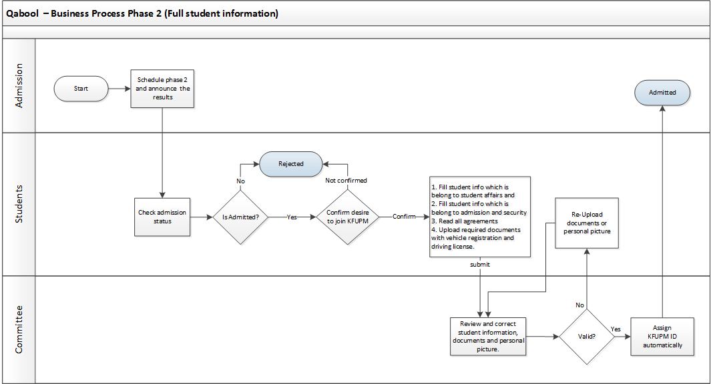

= Software Requirements Specification for Qabool
Information and Communication Technology Center (ICTC), KFUPM
Version 1.0, April 10, 2016: First version
:docinfo1:

include::includes/proprietary-information.adoc[]

[discrete]
== Version History

[cols="1,3,1,3",options="header",small]
|==================================================
| Version | Author(s) | Date      | Change
| 1.0 | Abdullah Joud, Bassam Almaaesh | 2016-04-10 | First version
| 2.0 | Abdullah Joud, Bassam Almaaesh | 2017-01-01 | Update
product functions and business process
| 2.0 | Bassam Almaaesh | 2017-02-15 | Update business process for phase 1,2,3 and 4
| 2.0 | Bassam Almaaesh | 2017-03-15 | Update phase 1 screens
|==================================================

[discrete]
== Approvals

[cols="1h,3,1h,1",frame=none,grid=none]
|==================================================
| Name        | Dr. Ahmad Khayyat                    | Role    | Sponsor
| Designation | Assistant Director             | Version | 2.0
| Department  | ICTC                                 | Date    | 2017-04-30
| Phone       | 013860-7270
| Email       | akhayyat@kfupm.edu.sa
|==================================================

[cols="1h,3,1h,1",frame=none,grid=none]
|==================================================
| Name        | Mr. Moawiya Taj | Role    | Client
| Designation | Director General, Admissions| Version | 2.0
| Department  | Admission Office |   Date  | 2017-04-30
| Phone       | 013860-4290
| Email       | moawiya@kfupm.edu.sa
|==================================================

<<<

== Introduction

=== Purpose and Intended Audience

The purpose of this document is to give a detailed description
of the requirements for _Qabool_.
It will contain all the details of the requested functionality as well as the wire-frames
that will be used in designing the system. This document is intended to be proposed to
department of admission office for approval. It will also be used as a reference for
the development team while developing the first version of the system.

=== Product Scope

_Qabool_ shall enable students to apply to enroll at KFUPM.
This system will cover the whole admission life-cycle including the following screens

* student application.
* admission screens.
* committee screen.
* student affairs screens.
* registrar office screen.
* English department screens.
* attendance system for orientation week.
* attendance system for university preparation course.
* student housing screens.

=== Definitions, Acronyms, and Abbreviations

[horizontal]
KFUPM::	King Fahd University of Petroleum & Minerals
ITC::	Information Technology Center
ADIS::	Administrative Information System
BI:: Business Intelligence
SMS:: Short Message Service
GSB:: Government Service Bus
Qiyas:: a government entity that conducts admission exams for Saudi universities
Quadrat:: a test conducted by Qiyas to measure a student's skills aptitude level
Tahsili:: a test conducted by Qiyas to asses a student's academic achievement level

=== References

None.

=== Overview of Document

This document is organized as follows: Section 2 gives an overall
description of the system, including the characteristics of its users
and its main functionality. The external interface requirements will be
discussed in Section 3. The functional requirements of the system will
discussed in detail in Section 4. Section 5 explains the other nonfunctional
requirements of the system.

== Overall Description

=== Product Perspective

This system is supposed to be an improvement of an already existing legacy system.
The admission department requested changes to the process and some additional
functionalities and reports.

=== Product Functions

==== Student Functions

* Registration with initial agreement.
* Login, logout, change password & dashboard.
* Student confirmation (only for accepted students by admission office).
And complete information with reading all agreements and upload required documents.
* Withdrawal and agreement (after confirmation the student
  can withdraw anytime).
* Re-upload required documents.
* Assign student KFUPM ID automatically.
* Print documents like admission letter, medical report and two letters that
belong to student housing.
* Search for roommate.
* Choosing student roommate.
* Upload & Re-upload personal picture.
* Reset password.
* Select time to visit building 54.
// * Select time for English written exam and interview.
// * Select time to attend University preparation course.

==== For Admission Office

* Upload list of denied students.
* Create new semester and enter start and end date for each phase.
* Review and correct student information.
* Manage schedule to attend building 54.
* Apply cut-off points and generate results based on student type (S, M and N) and nationality
* Calculate and take cut-off based on student GPAs using business intelligence (BI).
* Change password.

==== For Committee

* Review and correct student information.

==== For Student Affairs

* Manage schedule for university preparation course.
* Attendance for orientation week in building 54.
* Attendance for preparation course.

==== For Registrar

* Upload/enter list of KFUPM Student ID.

==== For English Dept.

* Manage schedule for English written and oral exams.
* Above all, the business intelligence (BI) will provide different type of reports for
student affairs, registrar office, information and communication technology center and admission office.

==== BI Reports

* View general statistics and reports
* General statistics
* Students report (with filters based on high-school GPA, status, nationality, and city)
* Denied students report
* Withdrawn students report

==== Business Process

There are four phases in _Qabool_ system.

[[context]]
.Phase one will be the registration phase and it will be open to all high-school students

[[context]]
.Phase 2 will be student confirmation and completing information

[[context]]
.Phase 3 printing admission letter, medical report, student housing contracts, other important documents and search for roommate
image::images/businessProcess/3.png[]

[[context]]
.Phase 4 Orientation week ( Reception in Building 54 and Reception University Preparation Course )
image::images/businessProcess/4.png[]

[[context]]
.Student withdrawn
image::images/businessProcess/withdrawn.png[]

=== User Classes and Characteristics

There are six major types of users that interact with the system.

Student::
The student can register, login, check the result in the dashboard,
upload required documents and print important documents.

Admission Administrator::
Admission Administrator can manage and filter students list, manipulate students'
uploaded documents and data entered. Also, he can access to all BI reports and assign user level to the users.

Committee::
Reviewer can review and verify entered students' information and documents and
correct mistakes if any.

Application administrator::
Application administrator can assign and define the roles.

Student affairs::
Student affairs department will have access to some BI reports only.

Registrar::
Registrar office department will have access to some BI reports only.

=== Operating Environment

The system is web-based. All functions shall be available through a web browser.

=== Design and Implementation Constraints

None.

=== Assumptions and Dependencies

_Qabool_ depends on Yesser GSB to fetch students high-school and Quadrat/Tahsili
tests data.

== External Interface Requirements

=== User Interfaces

==== Phase 1: Student Registration
[[context]]
.Qabool Homepage

'''
[[context]]
.Initial Agreements
image::images/phase1/initalAgreements.PNG[]
'''
[[context]]
.Student Registration
image::images/phase1/studentRegistration.png[]
'''
[[context]]
.Registration Successfully Message
image::images/phase1/success_registered.png[]
'''
[[context]]
.Denied Student Message

'''
[[context]]
.Error During Registration

'''
[[context]]
.Student Dashboard after Applying
image::images/phase1/studentDashboard.PNG[]
'''
[[context]]
.Homepage when the registration is closed

'''

==== Phase 2: Student Confirmation

[[context]]
.Rejected Student

'''
[[context]]
.Student Confirmation - Partial Admitted
image::images/phase2/StuConfirmation-1.PNG[]
'''
[[context]]
.Student Confirmation - Step1 Agreements

'''
[[context]]
image::images/phase2/StuConfirmation-3.PNG[]

[[context]]
image::images/phase2/StuConfirmation-31.PNG[]

[[context]]
.Student Confirmation - Step2.1 Student Information

'''
[[context]]
.Student Confirmation - Step2.2 Student Information

'''
[[context]]
.Student Confirmation - Step2.3 Student Information

'''
[[context]]
.Student Confirmation - Step2.4 Upload Docs for Saudi Students
image::images/phase2/StuConfirmation-6.PNG[]
'''
[[context]]
.Student Confirmation - Step2.4 Upload Docs for Saudi Mother Students
image::images/phase2/StuConfirmation-61.PNG[]
'''
[[context]]
.Student Confirmation - Step3.1 Student Agreement

'''
[[context]]
.Student Confirmation - Step3.2 Student Agreement

'''
[[context]]
.Student Confirmation - Step3.3 Student Agreement

'''
[[context]]
.Student Confirmation - Step3.4 Student Agreement
image::images/phase2/StuConfirmation-73.PNG[]
'''

==== Phase 3: Print Admission Letter and Medical Report

[[context]]
.Student Confirmation - Print Admission Letter and Medical Report

'''

[[context]]
.Print Admission Letter and Medical Report
image::images/phase3/admission_letter_schedule.png[]
'''

[[context]]
.Print Admission Letter
image::images/phase3/admLetter.png[]
'''

[[context]]
.Print Medical Report
image::images/phase3/medLetter.png[]
'''

[[context]]
image::images/phase3/StudentHousing.PNG[]

.Fill the Questionnaires for student housing
image::images/phase3/StudentHousing-2.PNG[]
'''

[[context]]
.Search Roommate

'''

==== Phase 4: Orientation Week and Attendance systems

=== Communications Interfaces

- The system must support email and SMS notifications for different activities.
These notifications include:

** Notifying students when the registration has been submitted successfully to admission.
[cols="1,3",options="header",small]
|==================================================
| System Messages  | English | Arabic
| Email Notification  | Dear <student name>,
Your request has been successfully submitted and the Admission results
will be announced on Wednesday June 15, 2016 ...

Registration Details
Registration ID: %(user_id)s
Mobile: %(mobile)s '
Registration Date: %(reg_date)s

You agreed to the following: %(agree_header)s
%(agree_items)s

You are recommended to frequently visit the admission website to know the
admission result and any updated instructions.

Admissions Office,
King Fahd University of Petroleum and Minerals. | [ عزيزي الطالب %(student_name)s, تم استلام طلبك بنجاح
وسيتم إعلان النتائج يوم اﻷربعاء 10 رمضان 1437 هـ حسب تقويم أم القرى  ...

تفاصيل الطلب
رقم التسجيل: %(user_id)s
رقم الجوال: %(mobile)s
تاريخ التسجيل: %(reg_date)s
الشروط و اﻷحكام:

فضلا شارك معنا في اﻻستبيان: http://goo.gl/erw8HQ .

 إدارة القبول،
جامعة الملك فهد للبترول والمعادن.
| SMS Notification  | Your request has been successfully submitted.
We appreciate your feedback: http://goo.gl/erw8HQ.
Admissions Office, KFUPM | تم استلام طلبك بنجاح. فضلا شارك معنا في الاستبيان:
http://goo.gl/erw8HQ .
إدارة القبول، جامعة الملك فهد للبترول والمعادن.
|==================================================

** Notifying students when they confirm and accept study at KFUPM.
** Notifying both application administrator and
students when the withdrawal has been submitted to admission.

== Functional Requirements

=== Students
==== Student Registration

[horizontal]
Capability ID::	Q.01

Description::	This capability allows the student to apply to study at KFUPM.

Rationale:: Students who are interested to study at KFUPM.

Source::	Student.

Fit Criteria::

In addition what we have in the current system in step/phase 1 we should add the following criteria:

. Add new fields called:
.. High School , Qudurat and Tahseel grades.
.. Student Full Name (Arabic) same as Identification ID/Iqama (show this field in student dashboard).
.. Student Full Name (English) same as passport or high school certificate (show this field in student dashboard).
.. Gender, default value is male.
. Add high school types:
.. Private - Public studies
.. Private - International studies.
. Change status message from : ('تم التقديم') to ('تم تقديم طلبك')
. Add note above the form (for best browser use Google Chrome or Firefox).
. Add note below mobile number (to receive a message you have to activate promotion message from your network provider).
. (Deleted) In the student dashboard move up student name and change caption name: "اسم الطالب الثنائي".
. (Deleted) Add new caption/label called gender: only for male.
. Student can edit the following fields till the end of phase 1:
.. Student Full Name Arabic and English.
.. Email and student mobile.
.. High school, Qudurat and Tahseel grades.
.. Student Note

Dependencies::	None.

Conflicts::	None.

Priority::	5

Risk::	1

Effort::	3

Approval::	Not yet approved.

==== Student Confirmation

[horizontal]
Capability ID::	Q.02

Description::	Partial admitted students can make confirmation to study at KFUPM and complete their informations
and also upload required documents including driving license and vehicle registration
documents for security department.

Rationale:: Students who are interested to study at KFUPM can confirm.

Source::	Students.

Fit Criteria::

In addition what we have in the current system step/phase 2, we should add the following criteria:
. Add new field called (do you have a car) and it is optional.
. If yes, the student can enter vehicle registration number and driving license.
. Also, the student can upload these two documents (vehicle registration number and driving license).
. Partial admitted students can upload personal picture and can edit the image using crop, resize and rotate.
. Partial admitted students can not edit their information once they submit the form.
. If partial admitted student doesn't confirm within the period, the system will reject his
application automatically.

Dependencies::	Q.01 and login screen

Conflicts::	None.

Priority::	5

Risk::	3

Effort::	3

Approval::	Not yet approved.

==== Student Reservation and Printing Documents

[horizontal]
Capability ID::	Q.03

Description::	Admitted students can make reservations in order to visit building 54 and also printing
admission letter and medical report.

Rationale:: To attend the orientation week and receive student schedule.

Source:: Students.

Fit Criteria::

In addition what we have in the current system, we move printing admission letter
and medical report to new step/phase 3 add the following criteria:
. This module will be open during step/phase 3.
. Only admitted students can access the system in order to make a reservation to visit building 54.
. Admitted student can not change the reservation once he select and submit form.
. The system will assign KFUPM ID to the student automatically once he make reservation.
. Admitted students can print admission letter after he select the reservation.
. Admitted students can print medical report.
. The admission letter contains the time-slot to visit building 54.

Dependencies::	login screen and Q.09

Conflicts::	None.

Priority::	5

Risk::	3

Effort::	3

Approval::	Not yet approved.

==== Find roommate

[horizontal]
Capability ID::	Q.04

Description::	Admitted students who are eligible for housing can search and select a roommate.

Rationale:: To search and find roommate.

Source::	Students.

Fit Criteria::
In addition what we have in the current system step/phase 3, we should add the following criteria:
. This module will start in step/phase 3 after printing admission letter and it will close before orientation week.
. Admitted student can answer the questionnaire.
. Add a new field called "Enter Your Partner KFUPM ID" to send a request to the partner.
. The roommate should be able to accept or reject the request.
. If both students agree, their information will not show in the search page.

Dependencies::	login screen , Q.03 and Q.09.

Conflicts::	None.

Priority::	4

Risk::	3

Effort::	3

Approval::	Not yet approved.

==== Student Withdrawn

[horizontal]
Capability ID::	Q.05

Description::	Admitted students have the opportunity to withdraw from the university.

Rationale:: Admitted students not interested to study at KFUPM.

Source::	Students.

Fit Criteria::
In addition what we have in the current system step/phase 3, we should add the following criteria:
. This module will start in step/phase 3 after student confirmation and printing documents.
. The last day for students to withdraw will be the end of the registration period.
. Once the student withdrawal is processed, the system will remove his KFUPM
ID and it will not be used in the system again.
. The system will send SMS notification to the student and his parent once he confirm and submit the form.

Dependencies::	login screen , Q.03 and Q.09.

Conflicts::	None.

Priority::	4

Risk::	3

Effort::	3

Approval::	Not yet approved.

=== Registrar

==== Upload KFUPM IDs

[horizontal]
Capability ID::	Q.06

Description::	The registrar should be able to upload KFUPM IDs in the current semester.

Rationale:: These KFUPM IDs will distribute to Admitted students and it will assign to them
random and automatically.

Source::	Registrar.

Fit Criteria::
. The registrar should be able to upload list of KFUPM IDs in the specific semester.
. All KFUPM IDs should be uniques.

Dependencies::	login screen.

Conflicts::	None.

Priority::	5

Risk::	3

Effort::	3

Approval::	Not yet approved.

=== English Department

==== Upload English results
[horizontal]

Capability ID::	Q.07

Description::	The English department should be able to upload the results of English written exam
for current semester.

Rationale:: For statistic purpose and the report will create through BI.

Source::	English Department.

Fit Criteria::
. English department will able to upload list of student results.
It contains only two fields (student ID and student level) for the current year/semester.

Dependencies::	who-attend-orientation-week and take English exam

Conflicts::	None.

Priority::	1

Risk::	1

Effort::	1

Approval::	Not yet approved.

==== Manage Written Exam and Interview Time-slot
[horizontal]

Capability ID::	Q.08

Description::	The English department can manage written exam and
interview for current semester in order to use it in step/phase 4.

Rationale:: To use it in the orientation week and print the schedule for the students in the reception.

Source::	English Department.

Fit Criteria::
. English department should able to add exam dates and sections information in the current semester
(note: usually they schedule only for two dates).
// And the fields are date and day.

// . Each date has many sections information ( the fields are : building number, section number,
//   maximum enrollment, interview start time, interview students per 10 minutes).

Dependencies::	None.

Conflicts::	None.

Priority::	5

Risk::	3

Effort::	3

Approval::	Not yet approved.

==== BI Reports

Fit Criteria::

. Display list of students per section for English exam and Interview.

=== Committee

==== Review and Verification Student Information
[horizontal]

Capability ID::	Q.09

Description::	The committee can view student's information and correct it if need.
It starts on the second day of step/phase 2.

Rationale:: To verify student's information.

Source::	Committee.

Fit Criteria::
. This module will open on second day of step/phase 2 once the student submit his application.
. Committee should be able to correct student full names bilingual (only full names).
. All fields should be "read only" except
.. full names
.. high school name, province, high school city, country,
.. eligible for housing,
.. expire Gov ID / Iqama and
.. birth of date and place
.. committee note and type of the problems.
. Committee should be able to review and verify student information.
. Committee should be able to remove/delete student's documents if any document is missing and it will go back to
the student in order to correct and re-upload the documents.
. Committee should be able to remove the student's picture and return back to student in order to re-upload it.
. The system should be able to assign KFUPM ID automatically (student ID)
if the application is valid.
. If the student not respond to correct his application during second step/phase 2,
his application will be rejected.

// And the fields are date and day.
// . Each date has many sections information ( the fields are : building number, section number,
//   maximum enrollment, interview start time, interview students per 10 minutes).

Dependencies::	Q.01 , Q.03 and login screen.

Conflicts::	None.

Priority::	5

Risk::	3

Effort::	3

Approval::	Not yet approved.

=== Admission Office

==== Manage Admission Time-slot
[horizontal]
Capability ID:: Q.10

Description::	The admission office can manage the time-slot in order to allow admitted students
to select proper time to attend orientation week and then print the admission letter.

Rationale:: To organize scheduling for the orientation week.

Source::	Admission Office.

Fit Criteria::
. Admission office should be able to add time-slot in order to organize
the schedule for the orientation week. (note: usually they schedule
only for two days and 8 time-slots).
. These slots only for admitted students.

Dependencies:: Q.09.

Conflicts::	None.

Priority::	5

Risk::	3

Effort::	3

Approval::	Not yet approved.

==== Sync Data from Yesser
[horizontal]
Capability ID:: Q.11

Description::	The admission office can retrieve data from Yesser in order to calculate students GPAs.

Rationale:: To calculate student GPAs.

Source::	Admission Office.

Fit Criteria::
. Admission office should be able to retrieve student information from Yesser.
.. Student Arabic name separated.
.. Student English name separated.
.. (another new fields especially for Yesser) High School , Qudurat and Tahseel grades.
.. High school name, province and city.
.. Birth of date and place.
.. Gender

Dependencies:: Q.01.

Conflicts::	None.

Priority::	5

Risk::	3

Effort::	3

Approval::	Not yet approved.

==== Apply Cut-Off Points
[horizontal]
Capability ID:: Q.12

Description::	The admission office can apply cut-off points based on students GPA
and their types (S, M and N ) and student nationalities.

Rationale:: To announce student results and nominate partial admitted.

Source::	Admission Office.

Fit Criteria::
. Admission office should be able to apply cut-off points based on students GPA student type
(S, M and N), graduation year, high school types and nationality.

Dependencies:: Q.09.

Conflicts::	None.

Priority::	5

Risk::	3

Effort::	3

Approval::	Not yet approved.

==== BI Reports
We should enhance and update current reports based on the new capabilities.

=== Student Housing

==== BI Reports

Fit Criteria::

. Display list of eligible students for housing and their status if they find a roommate or not yet.

=== Student Affairs

==== Reception System (in Building 54)
[horizontal]
Capability ID:: Q.13

Description::	This capability will allow the student affairs to print schedule for English exams and
preparation university course. And then give two copies: one for student and the other will print inside for student affairs.

Rationale::	In order to get student folder and schedule English exams and preparation university course.

Source::	Student Affairs.

Fit Criteria::

. The system will schedule only for admitted students.
. Student affairs should be able to enter student ID in order to print schedule for English exams and the course time and location.
. The system should schedule course time without any conflicts with English written exams and interview.
. If the student does not visit building 54 and print his scheduled exams and course,
he cannot attend the course of preparation university course.

Dependencies:: Q.03

Conflicts::	None.

Priority::	5

Risk::	3

Effort::	3

Approval::	Not yet approved.

==== Attendance System for Preparation Course
[horizontal]
Capability ID:: Q.14

Description::	This capability will allow the staff of student affairs to record
attendance for the students based on their schedule.

Rationale::	In order to attend the course and after that the students can receive books from bookstore.

Source::	Student Affairs.

Fit Criteria::

. Student affairs should be able to make attendance of each student per section.
. If the student does not visit building 54 and print his scheduled exams and course,
he cannot attend the course of preparation university course.
. If the student does not attend preparation course, the system will not allow him to receive books from bookstore.

Dependencies::	Q.12

Conflicts::	None.

Priority::	5

Risk::	3

Effort::	3

Approval::	Not yet approved.

==== BI Reports

Fit Criteria::

. Display list of students per section for preparation course.
. Display list of students who did not attend the course.
. Display list of students who attend orientation week and who did not.

=== Security Department

==== BI Reports

Fit Criteria::

. Display list of students who want to get car stickers with vehicle information.

== Other Nonfunctional Requirements

[[PerReq]]

=== Performance Requirements

* The web application should be hosted on a cloud service that should guarantee
99.9% uptime. In addition, The response time must be less than 5 seconds for all
 users' interactions
* The web application must support 1,000+ concurrent requesters which will on
a busy day generate 10,000+ interaction.

=== Safety Requirements

None.

=== Security Requirements

Since this system handles sensitive and mission-critical data, it should provide
tight data security that shall prevent direct and unauthorized access. Penetration testing
should be conducted (by third-party if possible) to assure that.

=== Software Quality Attributes

==== Portability

The web application should work on all major hand-held devices including
smart-phones and tablets. This should be achieved by using responsive user interface
that shall scale gracefully according to display screen size.

==== Reliability & Availability

Since this system is mission-critical to KFUPM, it should be hosted on reliable
hosting service that can fulfill <<PerReq,Performance Requirements>> stated above.
Moreover, system data must be backed up every day twice and the backup copies should be
stored at different physical location for disaster recovery.

==== Scalability

This system will be hosted on a cloud service to provide better performance. Hence,
the system should be designed and implemented to be cloud-ready. Stress testing should
be conducted (by third part if possible) to assure this.

==== Usability

Since this web application will be used by a large number of end-users from various
backgrounds, it should be user-friendly. The screen layouts should be trivial.
Field names should be clear and unambiguous and hints/tips should be
provided inline to explain complicated tasks required from users whenever necessary.

== Other Requirements

The web application should have bilingual user interface that can be used to
switch the display language at any time by the end-user. The layout should change
according to the display language between RTL and LTR.

[appendix]
== Agreements

=== Phase 1 Agreements

Before creating an account in phase 1.

==== English Version

==================================================
Dear student,

Assalamu Alaikum

WARNING: TODO: Translate the following paragraph to English!

يطيب لعمادة القبول والتسجيل بجامعة الملك فهد للبترول والمعادن أن تهنئك بالقبول
في الجامعة للعام الدراسي 1436/1437هـ متمنين لك حياة دراسية موفقة، ونود أن نؤكد
على أهمية النقاط التالية:

- You, the student, are fully responsible for the accuracy and validity of all
  of the information that you will provide in this application.

- The university's admission office will receive your scores directly from the
  Ministry of Education and the National Center for Measurement and Evaluation
  (Qiyas).

- The registration period starts on Sunday June 7, 2016 at 2:00 pm, and ends on
  Thursday June 18, 2016 at 9:00 pm.

- Candidates will be announced on Wednesday June 24, 2016 at 12:00 pm.

- Candidates will receive text messages on their mobile phones using the mobile
  phone numbers entered in this application.

- The university's admission website is the main official source for admission
  application results, and for up-to-date application instructions. It is,
  therefore, your responsibility to check it frequently.

- Upon receiving their candidacy notice, candidates who wish to study at the
  university must confirm their application, complete it online, and upload the
  required documents starting from Wednesday June 24, 2016 at 12:00 pm, and
  before 6:00 pm of Saturday June 27, 2016.

==================================================

==== Arabic Version

[.arabic]
==================================================

عزيزي الطالب

السلام عليكم ورحمة الله وبركاته

يطيب لعمادة القبول والتسجيل بجامعة الملك فهد للبترول والمعادن أن تهنئك بالقبول
في الجامعة للعام الدراسي 1436/1437هـ متمنين لك حياة دراسية موفقة، كما نود أن
نؤكد على أهمية النقاط التالية:

- التأكد من دقة وصحة جميع البيانات المدخلة مسؤولية الطالب الكاملة.

- تحصل إدارة القبول بالجامعة على نتائج الطالب للمرحلة الثانوية ونتائج اختبار
  القدرات و الاختبار التحصيلي من وزارة التعليم ومن المركز الوطني للقياس والتقويم
  مباشرة.

- تبدأ فترة التسجيل من الساعة 2 ظهر يوم الأحد 20 شعبان 1436هـ الموافق 7 يونيو
  2015م، وتنتهي الساعة 9 مساء يوم الخميس 1 رمضان 1436هـ الموافق 18 يونيو 2015م.

- تعلن نتائج المرشحين للقبول الساعة 12 ظهر يوم الأربعاء 7 رمضان 1436هـ الموافق
  24 يونيو 2015م.

- سيتم إعلام المرشحين للقبول بترشيحم عبر رسائل الجوال باستخدام رقم هاتف الجوال
  المدخل في النموذج الإلكتروني.

- يعتبر الموقع الإلكتروني لإدارة القبول المرجع الرئيس للإعلان عن القبول وعن
  التعليمات المستجدة. لذلك فعلى المتقدم مسؤولية متابعة الموقع الإلكتروني.

- في حال تم قبول ترشيح الطالب للجامعة ولديه الرغبة الكاملة في الدراسة بها، يجب
  عليه أن يؤكد ذلك وأن يستكمل البيانات اللازمة من خلال الموقع الإلكتروني لإدارة
  القبول في الفترة من 12 ظهر يوم الأربعاء 7 رمضان 1436هـ الموافق 24 يونيو 2015م
  إلى الساعة 6 مساء يوم السبت 10 رمضان 1436هـ الموافق 27 يونيو 2015م.

==================================================
